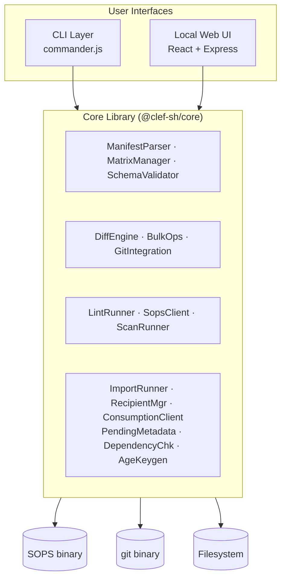
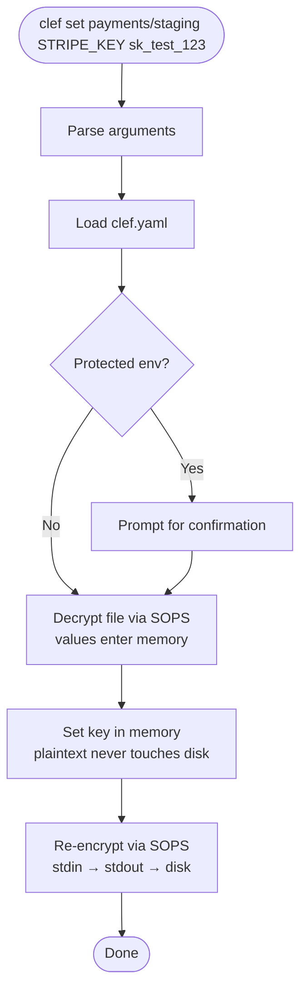
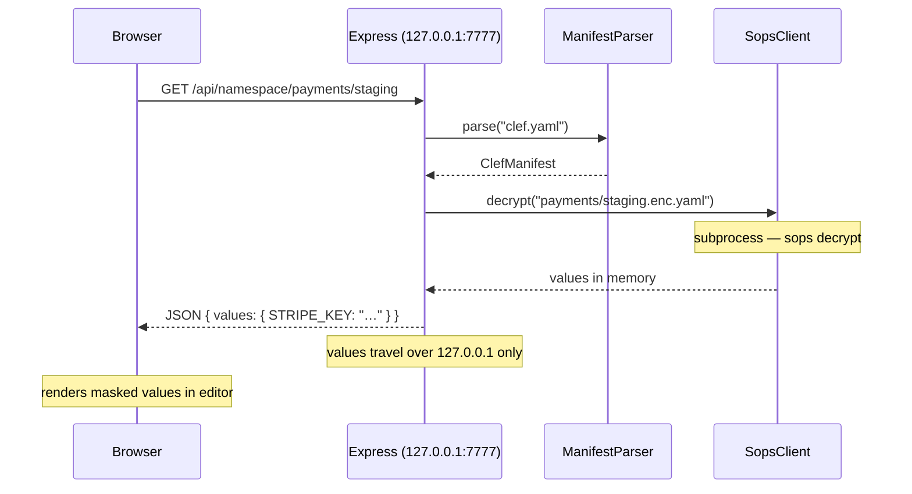
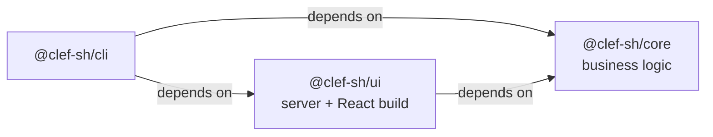

# Architecture

Clef's internal architecture: package relationships, data flow, and subprocess isolation.

## High-level overview



Both the CLI and the UI are thin interface layers. All business logic lives in `packages/core`, ensuring consistent behaviour across both surfaces.

## Module map

### ManifestParser (`packages/core/src/manifest/parser.ts`)

Loads and validates `clef.yaml`. Parses the YAML, validates all required fields, checks for duplicates, and returns a typed `ClefManifest` object.

### SopsClient (`packages/core/src/sops/client.ts`)

Thin subprocess wrapper around the `sops` binary. Provides three operations:

- **decrypt(filePath)** — calls `sops decrypt` and returns decrypted values in memory
- **encrypt(filePath, values, manifest, environment?)** — pipes plaintext YAML through `sops encrypt` via stdin and writes the encrypted output to disk. When `environment` is provided, per-environment backend overrides are resolved from the manifest.
- **reEncrypt(filePath, newKey)** — calls `sops rotate` to add a new recipient

The SopsClient takes a `SubprocessRunner` as a constructor dependency, enabling full mocking in tests.

### MatrixManager (`packages/core/src/matrix/manager.ts`)

Resolves the namespace-by-environment matrix from the manifest and file system. Determines which cells exist, which are missing, and scaffolds new cells by creating empty encrypted files.

### SchemaValidator (`packages/core/src/schema/validator.ts`)

Loads schema YAML files and validates decrypted key-value pairs against them. Produces typed `ValidationResult` objects with errors and warnings.

### DiffEngine (`packages/core/src/diff/engine.ts`)

Decrypts two files (same namespace, different environments) and compares their keys. Classifies each key as changed, identical, missing in A, or missing in B.

### BulkOps (`packages/core/src/bulk/ops.ts`)

Multi-file operations: set a key across all environments, delete a key across all environments.

### GitIntegration (`packages/core/src/git/integration.ts`)

Wrapper around the `git` binary for commits, status, log, diff, and pre-commit hook installation.

### LintRunner (`packages/core/src/lint/runner.ts`)

Orchestrates a full repo validation by combining MatrixManager (completeness), SchemaValidator (schema compliance), and SopsClient (encryption integrity).

### ScanRunner (`packages/core/src/scanner/index.ts`)

Scans the repository for plaintext secrets using pattern matching and entropy analysis. Respects `.clefignore` rules to exclude false positives.

### ImportRunner (`packages/core/src/import/index.ts`)

Parses external secret formats (`.env`, JSON, YAML) and imports them into the Clef matrix. Uses format-specific parsers from `import/parsers.ts`.

### RecipientManager (`packages/core/src/recipients/index.ts`)

Manages age recipients in `.sops.yaml` creation rules — listing, adding, and removing public keys. Includes a validator for key format.

### ConsumptionClient (`packages/core/src/consumption/client.ts`)

Reads and resolves secrets for consumption by `clef exec` and `clef export`. Handles namespace/environment targeting and value injection.

### PendingMetadata (`packages/core/src/pending/metadata.ts`)

Tracks keys set with `--random` as pending in `.clef-meta.yaml` files. Provides `markPending` and `markResolved` with retry logic for concurrent access.

### DependencyChecker (`packages/core/src/dependencies/checker.ts`)

Checks that required external binaries (SOPS, git) are installed and meet minimum version requirements. Used by `clef doctor` and as a guard in SopsClient.

### AgeKeygen (`packages/core/src/age/keygen.ts`)

Generates age key pairs using the `age-encryption` npm package. Used during `clef init` to create a local key.

## Data flow: `clef set`



Plaintext values exist only in process memory — piped to SOPS via stdin, never written to temporary files or logged.

## Data flow: `clef ui` (API request)



The API server binds exclusively to `127.0.0.1` — decrypted values travel only over the local loopback interface.

## Dependency injection

External subprocess calls (SOPS, git) are isolated behind the `SubprocessRunner` interface:

```typescript
interface SubprocessRunner {
  run(command: string, args: string[], options?: SubprocessOptions): Promise<SubprocessResult>;
}
```

In production, `NodeSubprocessRunner` uses `child_process.spawn` to execute real binaries. In tests, a mock is injected that returns predefined results without spawning processes. This enforces testability (no SOPS or git required) and makes all allowed subprocess calls explicit, preventing accidental plaintext leaks.

## Package dependency graph



Core has no dependencies on CLI or UI. CLI depends on both core and UI (for `clef ui`). UI depends on core for its API server.

## Repository layout

Clef follows a **co-located secrets** approach — secrets live in the same repository as application code. `clef.yaml` sits at the repo root and encrypted files in `secrets/`. `process.cwd()` is the repo root by default; no extra flags needed.

The `--dir` flag is implemented as a global option on the root Commander program. Each command reads `program.opts().dir || process.cwd()` to determine the repo root. This means the flag works uniformly with every command without per-command opt-in.

## Design decisions

Intentional and permanent choices — do not revisit without compelling reason and broad consensus.

### All namespaces are encrypted

Clef does not support `encrypted: false` on namespace definitions. Every file in the matrix is encrypted by SOPS without exception — this simplifies the security model, pre-commit hook, and linting logic. Non-sensitive config should live outside the Clef matrix.

See [Core Concepts — Design decision: all namespaces are encrypted](/guide/concepts#design-decision-all-namespaces-are-encrypted) for the full rationale.

### Memory clearing

Clef does not explicitly zero decrypted values in memory. Node.js strings are immutable and V8-managed — there is no reliable way to scrub the heap on demand. Decrypted values are never written to disk, but may remain in memory until garbage-collected.

If your threat model requires defence against memory-scraping, consider short-lived CI containers discarded after each job, or avoiding long-lived processes that hold decrypted data. This limitation applies equally to all Node.js secret-handling tools.
