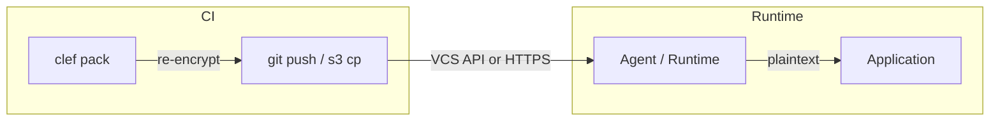

# Runtime Agent

The Clef agent is a runtime sidecar that decouples secrets from deployments. Secret changes and key rotations propagate to running workloads without redeployment.

## When to use the agent

Use the agent when:

- Secret rotation must not require redeployment
- You want a centralized secrets API for your application
- You need health and readiness probes for orchestrators (Kubernetes, ECS)
- Your workload runs as a container, standalone process, or Lambda function

If redeploy-on-change is acceptable, [`clef exec`](/cli/exec) or [`clef export`](/cli/export) may be simpler options.

## How it works



1. **`clef pack`** decrypts scoped SOPS files with the deploy key, re-encrypts to the service identity's key, and writes a JSON artifact
2. **CI delivers** the artifact — either by committing to git or uploading to S3/GCS
3. At runtime, the **agent** (or `@clef-sh/runtime` imported directly) fetches the artifact, decrypts it, and serves secrets via localhost
4. The agent **polls** automatically — at 80% of `expiresAt` if set, or at `cacheTtl / 10` otherwise — detecting new revisions and performing atomic cache swaps

## Artifact format

```json
{
  "version": 1,
  "identity": "api-gateway",
  "environment": "production",
  "packedAt": "2024-01-15T00:00:00.000Z",
  "revision": "1705276800000",
  "ciphertextHash": "sha256-hex-digest",
  "ciphertext": "YWdlLWVuY3J5cHRpb24ub3JnL3YxCi0+IFgy...",
  "expiresAt": "2024-01-15T01:00:00.000Z",
  "envelope": {
    "provider": "aws",
    "keyId": "arn:aws:kms:us-east-1:123456789012:key/...",
    "wrappedKey": "base64-encoded-wrapped-ephemeral-private-key",
    "algorithm": "SYMMETRIC_DEFAULT"
  }
}
```

| Field       | Required | Description                                                   |
| ----------- | -------- | ------------------------------------------------------------- |
| `envelope`  | No       | KMS envelope metadata. Present for KMS envelope identities.   |
| `expiresAt` | No       | ISO-8601 expiry. Agent rejects the artifact after this time.  |
| `revokedAt` | No       | ISO-8601 revocation timestamp. Agent wipes cache immediately. |

The `envelope` field is present when the identity uses KMS envelope encryption. It is omitted for age-only identities. When present, the artifact is self-describing — the runtime knows which KMS provider to call and which key to use. No KMS configuration is needed at runtime.

The `expiresAt` field is set when packing with `--ttl`. The `revokedAt` field is set by `clef revoke` — see [Revocation](#revocation) below.

## Packing artifacts

```bash
# Generate the artifact locally
clef pack api-gateway production --output ./artifact.json
```

### VCS delivery (default)

Commit the artifact to the repo so the agent can fetch it via the VCS API:

```yaml
# .github/workflows/pack.yml
name: Pack Secrets
on:
  push:
    branches: [main]

jobs:
  pack:
    runs-on: ubuntu-latest
    steps:
      - uses: actions/checkout@v4
      - uses: actions/setup-node@v4
        with:
          node-version: 22

      - name: Install dependencies
        run: npm ci

      - name: Pack artifact
        env:
          CLEF_AGE_KEY: ${{ secrets.CLEF_DEPLOY_KEY }}
        run: |
          npx @clef-sh/cli pack api-gateway production \
            --output .clef/packed/api-gateway/production.age.json

      - name: Commit packed artifact
        run: |
          git config user.name "github-actions[bot]"
          git config user.email "41898282+github-actions[bot]@users.noreply.github.com"
          git add .clef/packed/
          git commit -m "chore: pack api-gateway/production" || echo "No changes"
          git push
```

### Tokenless delivery (S3/HTTP)

Upload to an object store instead. The runtime fetches via HTTPS — no VCS token needed at runtime:

```yaml
# .github/workflows/pack.yml (tokenless variant)
- name: Pack artifact
  env:
    CLEF_AGE_KEY: ${{ secrets.CLEF_DEPLOY_KEY }}
  run: |
    npx @clef-sh/cli pack api-gateway production \
      --output ./artifact.json

- name: Upload to S3
  run: |
    aws s3 cp ./artifact.json \
      s3://my-secrets-bucket/clef/api-gateway/production.json \
      --sse AES256
```

See [Service Identities — Artifact Delivery](/guide/service-identities#artifact-delivery) for a full comparison of both backends.

## Installing the agent

### Standalone binary

Download a standalone `clef-agent` binary from [GitHub Releases](https://github.com/clef-sh/clef/releases) — no Node.js required:

::: code-group

```bash [macOS (Apple Silicon)]
curl -fsSLO https://github.com/clef-sh/clef/releases/latest/download/clef-agent-darwin-arm64
chmod +x clef-agent-darwin-arm64
sudo mv clef-agent-darwin-arm64 /usr/local/bin/clef-agent
```

```bash [macOS (Intel)]
curl -fsSLO https://github.com/clef-sh/clef/releases/latest/download/clef-agent-darwin-x64
chmod +x clef-agent-darwin-x64
sudo mv clef-agent-darwin-x64 /usr/local/bin/clef-agent
```

```bash [Linux (x64)]
curl -fsSLO https://github.com/clef-sh/clef/releases/latest/download/clef-agent-linux-x64
chmod +x clef-agent-linux-x64
sudo mv clef-agent-linux-x64 /usr/local/bin/clef-agent
```

```bash [Linux (ARM64)]
curl -fsSLO https://github.com/clef-sh/clef/releases/latest/download/clef-agent-linux-arm64
chmod +x clef-agent-linux-arm64
sudo mv clef-agent-linux-arm64 /usr/local/bin/clef-agent
```

:::

SHA256 checksums (`.sha256` files) are available alongside each binary on the release.

### npm

```bash
npm install @clef-sh/agent
```

Run via `npx @clef-sh/agent` or use the `clef-agent` binary from `node_modules/.bin`.

## Starting the agent

### VCS source (recommended)

```bash
export CLEF_AGENT_VCS_PROVIDER=github
export CLEF_AGENT_VCS_REPO=org/secrets
export CLEF_AGENT_VCS_TOKEN=ghp_...
export CLEF_AGENT_VCS_IDENTITY=api-gateway
export CLEF_AGENT_VCS_ENVIRONMENT=production
export CLEF_AGENT_AGE_KEY=AGE-SECRET-KEY-1...  # not needed for KMS envelope artifacts
clef-agent
```

### HTTP source (tokenless)

```bash
export CLEF_AGENT_SOURCE=https://my-secrets-bucket.s3.amazonaws.com/clef/api-gateway/production.json
export CLEF_AGENT_AGE_KEY=AGE-SECRET-KEY-1...  # not needed for KMS envelope artifacts

clef-agent
```

### Local file (development)

```bash
export CLEF_AGENT_SOURCE=./artifact.json
export CLEF_AGENT_AGE_KEY=AGE-SECRET-KEY-1...

clef-agent
```

### Configuration

All configuration via environment variables (universal for containers and Lambda):

| Variable                     | Default        | Description                                                |
| ---------------------------- | -------------- | ---------------------------------------------------------- |
| `CLEF_AGENT_VCS_PROVIDER`    | —              | VCS provider (`github`, `gitlab`, or `bitbucket`)          |
| `CLEF_AGENT_VCS_REPO`        | —              | Repository (`owner/repo`)                                  |
| `CLEF_AGENT_VCS_TOKEN`       | —              | VCS authentication token                                   |
| `CLEF_AGENT_VCS_IDENTITY`    | —              | Service identity name                                      |
| `CLEF_AGENT_VCS_ENVIRONMENT` | —              | Target environment                                         |
| `CLEF_AGENT_VCS_REF`         | default branch | Git ref (branch/tag/sha)                                   |
| `CLEF_AGENT_VCS_API_URL`     | —              | Custom API URL (self-hosted instances)                     |
| `CLEF_AGENT_SOURCE`          | —              | HTTP URL or local file path (alternative to VCS)           |
| `CLEF_AGENT_CACHE_PATH`      | —              | Disk cache path for VCS failure fallback                   |
| `CLEF_AGENT_PORT`            | `7779`         | HTTP API port                                              |
| `CLEF_AGENT_CACHE_TTL`       | `300`          | Max seconds to serve without a successful refresh (min 30) |
| `CLEF_AGENT_AGE_KEY`         | —              | Inline age private key (optional for KMS envelope)         |
| `CLEF_AGENT_AGE_KEY_FILE`    | —              | Path to age key file (optional for KMS envelope)           |
| `CLEF_AGENT_TOKEN`           | auto-generated | Bearer token for API auth                                  |
| `CLEF_AGENT_VERIFY_KEY`      | —              | Public key for artifact signature verification (PEM/DER)   |
| `CLEF_AGENT_TELEMETRY_URL`   | —              | OTLP endpoint for [telemetry](/guide/telemetry)            |
| `CLEF_AGENT_ID`              | auto-generated | Unique agent instance ID (UUID)                            |

::: info Age key is optional for KMS envelope artifacts
KMS envelope artifacts are self-describing — the runtime calls KMS Decrypt to unwrap the ephemeral key. No `CLEF_AGENT_AGE_KEY` or `CLEF_AGENT_AGE_KEY_FILE` is needed.
:::

## HTTP API

The agent serves a REST API on `127.0.0.1` only:

| Endpoint               | Auth         | Description                                                                     |
| ---------------------- | ------------ | ------------------------------------------------------------------------------- |
| `GET /v1/secrets`      | Bearer token | All secrets as JSON object                                                      |
| `GET /v1/secrets/:key` | Bearer token | Single secret `{ "value": "..." }`                                              |
| `GET /v1/keys`         | Bearer token | Array of key names                                                              |
| `GET /v1/health`       | None         | `{ "status": "ok", "revision": "...", "lastRefreshAt": ..., "expired": false }` |
| `GET /v1/ready`        | None         | `200` if loaded and fresh, `503` if not loaded or cache expired                 |

### Authentication

All secrets endpoints require a Bearer token:

```bash
curl -H "Authorization: Bearer $CLEF_AGENT_TOKEN" \
  http://127.0.0.1:7779/v1/secrets
```

The token is printed at startup or can be set via `CLEF_AGENT_TOKEN`.

### Application integration

```javascript
// Simple fetch from your application
const AGENT_URL = "http://127.0.0.1:7779";
const TOKEN = process.env.CLEF_AGENT_TOKEN;

async function getSecret(key) {
  const res = await fetch(`${AGENT_URL}/v1/secrets/${key}`, {
    headers: { Authorization: `Bearer ${TOKEN}` },
  });
  const { value } = await res.json();
  return value;
}

const dbUrl = await getSecret("DB_URL");
```

## Direct import (Node.js) {#direct-import-nodejs}

For Node.js applications, you can skip the sidecar entirely and import `@clef-sh/runtime` directly:

```bash
npm install @clef-sh/runtime
```

**VCS source:**

```javascript
import { init } from "@clef-sh/runtime";

const runtime = await init({
  provider: "github",
  repo: "org/secrets",
  identity: "api-gateway",
  environment: "production",
  token: process.env.CLEF_VCS_TOKEN,
  ageKey: process.env.CLEF_AGE_KEY, // optional for KMS envelope artifacts
});

const dbUrl = runtime.get("DB_URL");
```

**Tokenless (S3 + KMS envelope):**

```javascript
import { init } from "@clef-sh/runtime";

const runtime = await init({
  source: "https://my-secrets-bucket.s3.amazonaws.com/clef/api-gateway/production.json",
  // No token, no age key — artifact self-describes its KMS config.
  // Runtime calls KMS Decrypt using the workload's IAM role.
});

const dbUrl = runtime.get("DB_URL");
```

For long-running services with background polling:

```javascript
import { ClefRuntime } from "@clef-sh/runtime";

const runtime = new ClefRuntime({
  provider: "github",
  repo: "org/secrets",
  identity: "api-gateway",
  environment: "production",
  token: process.env.CLEF_VCS_TOKEN,
  ageKey: process.env.CLEF_AGE_KEY,
  cacheTtl: 300,
  cachePath: "/var/cache/clef",
});

await runtime.start();
runtime.startPolling();

// Secrets auto-refresh every 60s
app.get("/health", (req, res) => {
  res.json({ ready: runtime.ready });
});
```

## Deployment models

### Kubernetes / ECS sidecar

```yaml
# k8s-deployment.yaml
apiVersion: apps/v1
kind: Deployment
metadata:
  name: api-gateway
spec:
  template:
    spec:
      containers:
        - name: app
          image: my-app:latest
          env:
            - name: CLEF_AGENT_TOKEN
              valueFrom:
                secretKeyRef:
                  name: clef-agent
                  key: token

        - name: clef-agent
          image: clef-agent:latest
          env:
            - name: CLEF_AGENT_VCS_PROVIDER
              value: github
            - name: CLEF_AGENT_VCS_REPO
              value: org/secrets
            - name: CLEF_AGENT_VCS_TOKEN
              valueFrom:
                secretKeyRef:
                  name: clef-agent
                  key: vcs-token
            - name: CLEF_AGENT_VCS_IDENTITY
              value: api-gateway
            - name: CLEF_AGENT_VCS_ENVIRONMENT
              value: production
            - name: CLEF_AGENT_AGE_KEY
              valueFrom:
                secretKeyRef:
                  name: clef-agent
                  key: age-key
          livenessProbe:
            httpGet:
              path: /v1/health
              port: 7779
          readinessProbe:
            httpGet:
              path: /v1/ready
              port: 7779
```

### Lambda Extension

The agent SEA binary auto-detects the Lambda environment (`AWS_LAMBDA_RUNTIME_API`) and switches to extension mode — no separate entry point or configuration flag needed. It registers with the Lambda Extensions API, loads secrets before the first invocation, and refreshes them between invocations when the cache TTL expires.

This is the deployment path for **non-Node.js Lambda functions** (Python, Go, Java, Rust, etc.). Node.js functions can import `@clef-sh/runtime` directly without the agent.

**Lambda Layer structure:**

```
layer.zip
├── clef-agent/
│   └── clef-agent          # SEA binary (linux-x64 or linux-arm64)
└── extensions/
    └── clef-agent           # Entry script (exec /opt/clef-agent/clef-agent)
```

Pre-built layer zips are attached to each [GitHub Release](https://github.com/clef-sh/clef/releases) (`clef-agent-lambda-x64.zip` and `clef-agent-lambda-arm64.zip`).

**Deploy the layer:**

```bash
# Publish the layer
aws lambda publish-layer-version \
  --layer-name clef-agent \
  --zip-file fileb://clef-agent-lambda-x64.zip \
  --compatible-runtimes python3.12 java21 provided.al2023 \
  --compatible-architectures x86_64

# Attach to your function
aws lambda update-function-configuration \
  --function-name my-function \
  --layers arn:aws:lambda:us-east-1:123456789012:layer:clef-agent:1 \
  --environment "Variables={
    CLEF_AGENT_SOURCE=https://my-bucket.s3.amazonaws.com/clef/api-gateway/production.age.json,
    CLEF_AGENT_CACHE_TTL=300
  }"
```

Your function handler fetches secrets from the agent over localhost:

```python
# Python example
import urllib.request, json

def handler(event, context):
    token = "..."  # from CLEF_AGENT_TOKEN env var
    req = urllib.request.Request(
        "http://127.0.0.1:7779/v1/secrets",
        headers={"Authorization": f"Bearer {token}"},
    )
    secrets = json.loads(urllib.request.urlopen(req).read())
    db_url = secrets["DB_URL"]
    # ...
```

### Local development

```bash
# Fetch from a local artifact file
CLEF_AGENT_SOURCE=./artifact.json \
CLEF_AGENT_AGE_KEY=AGE-SECRET-KEY-1... \
  clef-agent
```

## Secret rotation without redeploy

```
Developer: clef set payments/prod STRIPE_KEY new_value → commit → push
CI:        clef pack → deliver artifact (git push or s3 cp) → done
Runtime:   agent polls → detects new revision → fetches → decrypts
App:       GET /v1/secrets/STRIPE_KEY → returns new value
```

No CI "rotation job" needed — this is your normal merge workflow. The CI step that runs `clef pack` is the same one that runs on every push to main.

## Key rotation without redeploy

**Age-only identities:**

```
Developer: clef service rotate api-gateway -e production → new key pair
           Update private key in KMS/secrets manager
CI:        clef pack → new artifact encrypted to new public key → deliver
Runtime:   agent fetches new artifact + uses new private key → seamless
```

**KMS envelope identities:**

No key rotation needed. Each `clef pack` generates a fresh ephemeral key pair automatically.

## Cache TTL

The agent refuses to serve secrets that haven't been successfully refreshed within a configurable window. This bounds the blast radius of a compromised token or unreachable source.

```bash
export CLEF_AGENT_CACHE_TTL=300  # default: 5 minutes
```

If the agent cannot reach the source for longer than the TTL:

1. In-memory cache is wiped
2. Disk cache is purged (if configured)
3. `/v1/secrets` and `/v1/keys` return 503
4. `/v1/ready` returns `{ "ready": false, "reason": "cache_expired" }`
5. `/v1/health` reports `"expired": true`

The TTL is a hard backstop — even if polling breaks entirely, the agent stops serving after `CLEF_AGENT_CACHE_TTL` seconds.

## Artifact TTL

Pack an artifact with a built-in expiry using `--ttl`:

```bash
clef pack api-gateway production \
  --output ./artifact.json \
  --ttl 3600  # 1 hour
```

This embeds an `expiresAt` timestamp in the artifact. The agent rejects the artifact after that time, regardless of cache TTL. Use this when you want the artifact itself to be time-bounded — for example, short-lived credentials that should not be served beyond a known window.

## Revocation

`clef revoke` is the emergency brake. It overwrites the packed artifact with a revocation marker:

```bash
clef revoke api-gateway production
git add .clef/packed/api-gateway/production.age.json
git commit -m "revoke(api-gateway): compromised deploy token"
git push
```

The agent detects the `revokedAt` field on the next poll and immediately wipes its cache. Secrets endpoints return 503 until a new artifact is packed and delivered.

### Revocation timeline

With `CLEF_AGENT_CACHE_TTL=30` (polls every 3 seconds) and automated CI (a `workflow_dispatch` that runs `clef revoke`, commits, and pushes), revocation takes effect in under 15 seconds.

### Restoring after revocation

Rotate your secrets, repack, and push:

```bash
clef set api/production API_KEY new-key-value
clef pack api-gateway production \
  --output .clef/packed/api-gateway/production.age.json
git add .clef/packed/ api/production.enc.yaml
git commit -m "chore: rotate and repack api-gateway/production"
git push
```

The agent picks up the new artifact on the next poll and resumes serving.

## See also

- [`clef pack`](/cli/pack) — CLI reference for the pack command
- [`clef revoke`](/cli/revoke) — emergency revocation reference
- [`clef-agent`](/cli/agent) — standalone agent reference
- [Telemetry](/guide/telemetry) — OTLP event emission for observability and governance
- [Dynamic Secrets](/guide/dynamic-secrets) — using the agent with dynamic credential endpoints
- [Service Identities](/guide/service-identities) — creating identities and packing artifacts
- [CI/CD Integration](/guide/ci-cd) — pipeline setup
