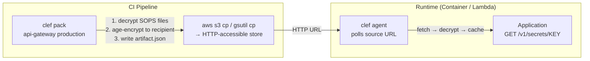

# Runtime Agent

The Clef agent is a runtime sidecar that decouples secrets from deployments. Secret changes and key rotations propagate to running workloads without redeployment.

## When to use the agent

Use the agent when:

- Secret rotation must not require redeployment
- You want a centralized secrets API for your application
- You need health and readiness probes for orchestrators (Kubernetes, ECS)
- Your workload runs as a container, standalone process, or Lambda function

If redeploy-on-change is acceptable, [`clef exec`](/cli/exec) or [`clef export`](/cli/export) may be simpler options.

## How it works



1. **`clef pack`** decrypts scoped SOPS files, age-encrypts the merged values to the service identity's public key, and writes a JSON artifact
2. **CI uploads** the artifact to any HTTP-accessible store (S3, GCS, Azure Blob, etc.) using existing cloud tools
3. **`clef agent`** fetches the artifact from the URL, decrypts in memory, and serves secrets via a localhost HTTP API
4. The agent **polls** the source URL at a configurable interval, detecting new revisions and performing atomic cache swaps

## Artifact format

The artifact is a JSON envelope — language-agnostic and forward-compatible:

```json
{
  "version": 1,
  "identity": "api-gateway",
  "environment": "production",
  "packedAt": "2024-01-15T00:00:00.000Z",
  "revision": "1705276800000",
  "ciphertextHash": "sha256-hex-digest",
  "ciphertext": "-----BEGIN AGE ENCRYPTED FILE-----\n...",
  "keys": ["DB_URL", "API_KEY", "STRIPE_KEY"]
}
```

## Packing artifacts

```bash
# Generate the artifact locally
clef pack api-gateway production --output ./artifact.json

# Upload with your CI tools (Clef has zero cloud SDK dependencies)
aws s3 cp ./artifact.json s3://my-bucket/clef/api-gateway/production.json
# or: gsutil cp, az storage blob upload, scp, etc.
```

### CI workflow example

```yaml
# .github/workflows/deploy.yml
name: Pack Secrets
on:
  push:
    branches: [main]

jobs:
  pack:
    runs-on: ubuntu-latest
    steps:
      - uses: actions/checkout@v4
      - uses: actions/setup-node@v4
        with:
          node-version: 22

      - name: Install dependencies
        run: npm ci

      - name: Pack artifact
        env:
          CLEF_AGE_KEY: ${{ secrets.CLEF_DEPLOY_KEY }}
        run: |
          npx @clef-sh/cli pack api-gateway production \
            --output ./artifact.json

      - name: Upload to S3
        run: |
          aws s3 cp ./artifact.json \
            s3://my-bucket/clef/api-gateway/production.json
```

## Installing the agent

### npm

```bash
npm install -g @clef-sh/cli
```

The `clef agent` command is included in the CLI package.

### Standalone binary

Download a standalone `clef-agent` binary from [GitHub Releases](https://github.com/clef-sh/clef/releases) — no Node.js required:

::: code-group

```bash [macOS (Apple Silicon)]
curl -fsSLO https://github.com/clef-sh/clef/releases/latest/download/clef-agent-darwin-arm64
chmod +x clef-agent-darwin-arm64
sudo mv clef-agent-darwin-arm64 /usr/local/bin/clef-agent
```

```bash [macOS (Intel)]
curl -fsSLO https://github.com/clef-sh/clef/releases/latest/download/clef-agent-darwin-x64
chmod +x clef-agent-darwin-x64
sudo mv clef-agent-darwin-x64 /usr/local/bin/clef-agent
```

```bash [Linux (x64)]
curl -fsSLO https://github.com/clef-sh/clef/releases/latest/download/clef-agent-linux-x64
chmod +x clef-agent-linux-x64
sudo mv clef-agent-linux-x64 /usr/local/bin/clef-agent
```

```bash [Linux (ARM64)]
curl -fsSLO https://github.com/clef-sh/clef/releases/latest/download/clef-agent-linux-arm64
chmod +x clef-agent-linux-arm64
sudo mv clef-agent-linux-arm64 /usr/local/bin/clef-agent
```

:::

SHA256 checksums (`.sha256` files) are available alongside each binary on the release.

## Starting the agent

```bash
clef agent start \
  --source https://my-bucket.s3.amazonaws.com/clef/api-gateway/production.json \
  --port 7779
```

Or via environment variables:

```bash
export CLEF_AGENT_SOURCE=https://my-bucket.s3.amazonaws.com/clef/api-gateway/production.json
export CLEF_AGENT_AGE_KEY=AGE-SECRET-KEY-1...
export CLEF_AGENT_PORT=7779
export CLEF_AGENT_POLL_INTERVAL=30

clef agent start
```

### Configuration

All configuration via environment variables (universal for containers and Lambda):

| Variable                   | Default        | Description                             |
| -------------------------- | -------------- | --------------------------------------- |
| `CLEF_AGENT_SOURCE`        | (required)     | HTTP URL or local file path to artifact |
| `CLEF_AGENT_PORT`          | `7779`         | HTTP API port                           |
| `CLEF_AGENT_POLL_INTERVAL` | `30`           | Seconds between polls                   |
| `CLEF_AGENT_AGE_KEY`       | —              | Inline age private key                  |
| `CLEF_AGENT_AGE_KEY_FILE`  | —              | Path to age key file                    |
| `CLEF_AGENT_TOKEN`         | auto-generated | Bearer token for API auth               |

CLI flags (`--source`, `--port`, `--poll-interval`) override the corresponding env vars.

## HTTP API

The agent serves a REST API on `127.0.0.1` only:

| Endpoint               | Auth         | Description                             |
| ---------------------- | ------------ | --------------------------------------- |
| `GET /v1/secrets`      | Bearer token | All secrets as JSON object              |
| `GET /v1/secrets/:key` | Bearer token | Single secret `{ "value": "..." }`      |
| `GET /v1/keys`         | Bearer token | Array of key names                      |
| `GET /v1/health`       | None         | `{ "status": "ok", "revision": "..." }` |
| `GET /v1/ready`        | None         | `200` if loaded, `503` if not           |

### Authentication

All secrets endpoints require a Bearer token:

```bash
curl -H "Authorization: Bearer $CLEF_AGENT_TOKEN" \
  http://127.0.0.1:7779/v1/secrets
```

The token is printed at startup or can be set via `CLEF_AGENT_TOKEN`.

### Application integration

```javascript
// Simple fetch from your application
const AGENT_URL = "http://127.0.0.1:7779";
const TOKEN = process.env.CLEF_AGENT_TOKEN;

async function getSecret(key) {
  const res = await fetch(`${AGENT_URL}/v1/secrets/${key}`, {
    headers: { Authorization: `Bearer ${TOKEN}` },
  });
  const { value } = await res.json();
  return value;
}

const dbUrl = await getSecret("DB_URL");
```

## Deployment models

### Kubernetes / ECS sidecar

```yaml
# k8s-deployment.yaml
apiVersion: apps/v1
kind: Deployment
metadata:
  name: api-gateway
spec:
  template:
    spec:
      containers:
        - name: app
          image: my-app:latest
          env:
            - name: CLEF_AGENT_TOKEN
              valueFrom:
                secretKeyRef:
                  name: clef-agent
                  key: token

        - name: clef-agent
          image: clef-agent:latest
          env:
            - name: CLEF_AGENT_SOURCE
              value: https://my-bucket.s3.amazonaws.com/clef/api-gateway/production.json
            - name: CLEF_AGENT_AGE_KEY
              valueFrom:
                secretKeyRef:
                  name: clef-agent
                  key: age-key
          livenessProbe:
            httpGet:
              path: /v1/health
              port: 7779
          readinessProbe:
            httpGet:
              path: /v1/ready
              port: 7779
```

### Lambda Extension

The agent can run as a Lambda Extension, refreshing secrets between invocations:

```bash
# extensions/clef-agent (entry script in Lambda Layer)
#!/bin/bash
exec node /opt/clef-agent/dist/lambda-entry.js
```

The Lambda Extension registers with the Extensions API and refreshes secrets when the configured TTL expires between invocations.

### Local development

```bash
# Fetch from a local artifact file
clef agent start --source ./artifact.json --port 7779
```

## Secret rotation without redeploy

```
Developer: clef set payments/prod STRIPE_KEY new_value → commit → push
CI:        clef pack → artifact.json → aws s3 cp → S3
Runtime:   agent polls URL → detects new revision → fetches → decrypts
App:       GET /v1/secrets/STRIPE_KEY → returns new value
```

## Key rotation without redeploy

```
Developer: clef service rotate api-gateway -e production → new key pair
           Update private key in KMS/secrets manager
CI:        clef pack → new artifact encrypted to new public key → S3
Runtime:   agent fetches new artifact + uses new private key → seamless
```

## See also

- [`clef pack`](/cli/pack) — CLI reference for the pack command
- [`clef agent`](/cli/agent) — CLI reference for the agent command
- [Service Identities](/guide/service-identities) — creating identities and packing artifacts
- [CI/CD Integration](/guide/ci-cd) — pipeline setup
