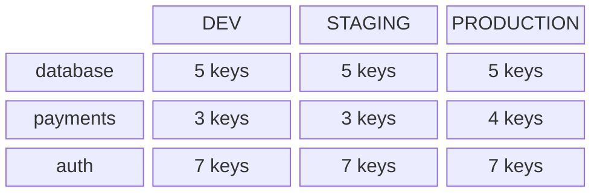

# Core Concepts

This page explains the mental model behind Clef.

## Who Clef is for

Clef is a secrets management tool **for developers** that supports ops and security workflows — not an ops or security tool that happens to have developer support. The distinction matters: every design decision starts from the developer's daily experience (editing secrets, reviewing PRs, debugging config) and works outward. Ops-oriented features like production isolation, drift detection, and CI integration exist because they make the developer workflow sustainable at scale, not as ends in themselves.

## The two-axis model

Every secret in a Clef-managed repository lives at the intersection of two axes:

| Axis            | Answers                                      | Examples                                |
| --------------- | -------------------------------------------- | --------------------------------------- |
| **Namespace**   | What part of the system does this belong to? | `database`, `auth`, `payments`, `email` |
| **Environment** | Which deployment does this apply to?         | `dev`, `staging`, `production`          |

This produces a matrix. Each cell in the matrix is a single encrypted YAML file containing the key-value pairs for that namespace in that environment.



On disk, the matrix maps to a directory structure inside a `secrets/` directory:

```
your-repo/
├── src/
├── clef.yaml
└── secrets/
    ├── database/
    │   ├── dev.enc.yaml
    │   ├── staging.enc.yaml
    │   └── production.enc.yaml
    ├── payments/
    │   ├── dev.enc.yaml
    │   ├── staging.enc.yaml
    │   └── production.enc.yaml
    └── auth/
        ├── dev.enc.yaml
        ├── staging.enc.yaml
        └── production.enc.yaml
```

The two-axis model makes two problems visible that are otherwise invisible with raw SOPS:

1. **Missing cells** — a namespace/environment combination that should exist but does not. This means someone added a new environment but forgot to create files for it.
2. **Key drift** — a key that exists in some environments but not others within the same namespace. For example, a key was added to `dev` but never promoted to `staging` or `production`. Clef compares the full set of keys across all environments in a namespace, not just the count.

Both problems are caught by `clef lint` and visualised in the UI matrix view.

## The manifest

The manifest is `clef.yaml` at the root of your repository — Clef's single source of truth:

```yaml
version: 1

environments:
  - name: dev
    description: Local development
  - name: staging
    description: Pre-production
  - name: production
    description: Live system
    protected: true

namespaces:
  - name: database
    description: Database connection config
    schema: schemas/database.yaml
  - name: auth
    description: Auth and identity secrets
  - name: payments
    description: Payment provider credentials

sops:
  default_backend: age

file_pattern: "secrets/{namespace}/{environment}.enc.yaml"
```

::: tip age key location
When using the age backend, each developer's key label and storage method are stored in `.clef/config.yaml` (gitignored) — not in the manifest. The private key lives in the OS keychain or at `~/.config/clef/keys/{label}/keys.txt`, always outside the repository.
:::

For a full field-by-field reference, see the [Manifest Reference](/guide/manifest).

## Schemas

A schema defines the expected keys for a namespace: which keys are required, what type each value should be, and optional regex patterns for validation.

```yaml
# schemas/database.yaml
keys:
  DATABASE_URL:
    type: string
    required: true
    pattern: "^postgres://"
    description: PostgreSQL connection string
  DATABASE_POOL_SIZE:
    type: integer
    required: false
    default: 10
  DATABASE_SSL:
    type: boolean
    required: true
```

When a namespace has a schema, Clef validates every encrypted file against it during `clef lint`. The UI also shows schema compliance inline in the editor view.

Schemas catch three categories of problems:

| Category                 | Example                                                        |
| ------------------------ | -------------------------------------------------------------- |
| **Missing required key** | `DATABASE_URL` is required but absent in `production`          |
| **Type mismatch**        | `DATABASE_POOL_SIZE` should be an integer but contains `"abc"` |
| **Undeclared key**       | `LEGACY_DB_HOST` exists in the file but is not in the schema   |

For the full schema specification, see the [Schema Reference](/schemas/reference).

## Git-native philosophy

Clef treats git as the only persistence layer — no external database, cloud sync, or server. Secrets are version-controlled like any other config: history is in git log, changes propagate via pull, and backups are git remotes. The UI surfaces git state throughout: current branch, uncommitted file count, and commit flow.

## Protected environments

Environments marked `protected: true` require explicit confirmation before Clef writes to them. The CLI prompts:

```
This is a protected environment (production). Confirm? (y/N)
```

The UI shows a persistent red warning banner on the production tab.

## The SOPS layer

Clef never implements cryptography. All encryption and decryption is delegated to the `sops` binary via stdin/stdout pipes. Decrypted values exist only in memory — never written to temporary files or logged. Clef inherits all SOPS backend support (age, AWS KMS, GCP KMS, PGP) without implementing any of it.

## Design decision: all namespaces are encrypted

Clef has no `encrypted: false` option. Every file in the matrix is encrypted by SOPS, without exception. A single rule is easier to audit and enforce than mixed-mode. Non-sensitive config belongs in a regular config file outside the Clef matrix.

## Repository structure

Clef supports two approaches to organizing secrets. Choose based on your team size, compliance requirements, and security posture.

### Co-located secrets

Secrets live in the same repository as the code that uses them, inside a `secrets/` directory. This is the simplest pattern and works well for many teams.

```
my-app/
├── src/
├── package.json
├── clef.yaml
└── secrets/
    ├── database/
    │   ├── dev.enc.yaml
    │   ├── staging.enc.yaml
    │   └── production.enc.yaml
    └── auth/
        ├── dev.enc.yaml
        ├── staging.enc.yaml
        └── production.enc.yaml
```

**Why co-location works well:**

- **Blast radius containment.** Each repo has its own age key. Compromising one repo's key does not expose any other repo's secrets.
- **Built-in validation.** `clef lint` catches missing keys, schema violations, and environment gaps before they become production problems.
- **Single checkout.** Code, config, and credentials are in one place. `git checkout <sha> && clef exec ... -- deploy.sh` deploys from one ref with no separate repo to coordinate.
- **Atomic reviews.** Secrets and code change in the same PR.
- **No sync step.** Developers get secret changes by pulling the repository.

### Production isolation

For regulated or security-conscious organizations, production ciphertext can live in a **separate repository** accessible only to ops/SRE teams and production CI/CD. The dev repo holds `dev` and `staging` environments; the production repo holds only `production`.

```
# Dev repo (accessible to all engineers)
my-app/
├── src/
├── clef.yaml          # environments: dev, staging
└── secrets/
    └── database/
        ├── dev.enc.yaml
        └── staging.enc.yaml

# Production repo (restricted to ops)
my-app-production/
├── clef.yaml          # environments: production
└── secrets/
    └── database/
        └── production.enc.yaml
```

**Why production isolation matters:**

- **Least privilege.** Developers who need `dev` and `staging` secrets never see production ciphertext.
- **Compliance.** SOC 2, PCI-DSS, and HIPAA frameworks may require separate storage and audit trails for production credentials.
- **Defense in depth.** Splitting repos ensures that production ciphertext is never cloned to developer machines — even accidentally. A leaked dev repo exposes no production material.

Use `clef drift` to keep key sets in sync across repos — it compares without decryption and works without sops installed. See [Production Isolation](/guide/production-isolation) for the full setup guide.

### Why not a shared monorepo for all services

The arguments against a single shared secrets repository (all services, all teams) remain strong regardless of which pattern you choose above:

- **Single point of compromise.** One key exposes secrets for every service.
- **Invisible drift.** Secret changes are decoupled from the code that consumes them.
- **Unclear ownership.** Multiple teams sharing one repo means unclear review responsibility.
- **Operational friction.** Every change requires coordinating across teams and repos.

::: tip Access control
By default, a recipient added with `clef recipients add` can decrypt all environments. Clef provides two ways to restrict access within a repo:

- **Per-environment recipients** — scope recipients to specific environments with `clef recipients add <key> -e production`.
- **Per-environment backends** — configure production to use a KMS backend (AWS KMS, GCP KMS) while dev/staging use age. See [Per-environment SOPS override](/guide/manifest#per-environment-sops-override).

For a comparison of these approaches, see [age vs KMS](/guide/quick-start#age-vs-kms-choosing-an-encryption-backend).
:::

### Using `--dir` for other local repos

The `--dir` flag points Clef at a different local directory instead of the current working directory:

```bash
clef --dir ../other-project get database/production DB_URL
clef --dir /opt/my-app lint
```

## Pending values

When you set up a new namespace without real credentials yet, use **pending values** — cryptographically random placeholders that keep your encrypted files valid and matrix complete until real secrets are available.

```bash
clef set payments/staging STRIPE_SECRET_KEY --random  # scaffold
clef set payments/staging STRIPE_SECRET_KEY sk_live_abc123  # replace later
```

Pending state is tracked in `.clef-meta.yaml` sidecar files (plaintext, committed, key names only — never values). See [Pending Values](/guide/pending-values).

## Next steps

[Next: Manifest Reference](/guide/manifest)
