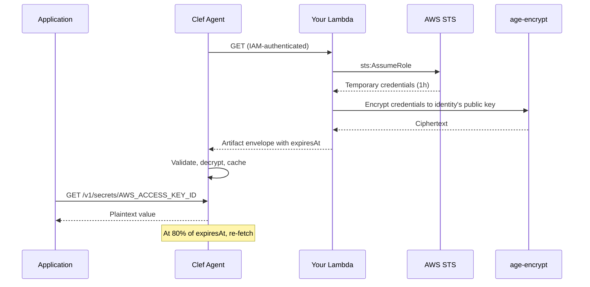

# Dynamic Secrets

Dynamic secrets are short-lived credentials generated on demand, rather than static values stored in encrypted files. They reduce blast radius — a leaked credential expires before an attacker can use it — and eliminate the need for manual rotation.

Clef's approach is a **framework**, not a managed service. The [runtime agent](/guide/agent) already consumes any HTTP endpoint that returns the artifact envelope contract. You implement the credential logic in your own infrastructure (a Lambda function, Cloud Function, or any HTTPS endpoint). Clef defines the contract; you control the policy.

No adapters to install. No marketplace. No vendor lock-in on the credential side.

## The contract

The agent fetches a URL and expects a JSON response matching the artifact envelope schema:

```json
{
  "version": 1,
  "identity": "api-gateway",
  "environment": "production",
  "packedAt": "2026-03-22T00:00:00.000Z",
  "revision": "1711065600000",
  "ciphertextHash": "sha256-hex-digest",
  "ciphertext": "-----BEGIN AGE ENCRYPTED FILE-----\n...",
  "keys": ["AWS_ACCESS_KEY_ID", "AWS_SECRET_ACCESS_KEY", "AWS_SESSION_TOKEN"],
  "expiresAt": "2026-03-22T01:00:00.000Z"
}
```

| Field            | Required | Description                                                      |
| ---------------- | -------- | ---------------------------------------------------------------- |
| `version`        | Yes      | Always `1`                                                       |
| `identity`       | Yes      | Service identity name                                            |
| `environment`    | Yes      | Target environment                                               |
| `packedAt`       | Yes      | ISO-8601 timestamp when the credential was minted                |
| `revision`       | Yes      | Monotonically increasing revision (e.g. epoch millis)            |
| `ciphertextHash` | Yes      | SHA-256 hex digest of `ciphertext` for integrity checking        |
| `ciphertext`     | Yes      | age-encrypted blob containing the secret key-value pairs         |
| `keys`           | Yes      | Array of key names in the encrypted blob                         |
| `expiresAt`      | No       | ISO-8601 expiry. Agent rejects the artifact after this time      |
| `revokedAt`      | No       | ISO-8601 revocation timestamp. Agent wipes cache and returns 503 |

### How the agent uses `expiresAt`

When `expiresAt` is present, the agent schedules a refresh at **80% of the remaining lifetime**. For a 1-hour credential, the agent re-fetches at ~48 minutes. This ensures the application always has a valid credential, with a comfortable margin before expiry.

If the refresh fails, the agent retries with exponential backoff. If the credential expires before a successful refresh, the agent wipes its cache and returns 503 on all secrets endpoints — your application gets a clear failure signal rather than a stale credential.

## Architecture

Your dynamic endpoint is a standard HTTPS function. The agent treats it identically to any other artifact source — it just happens to return a fresh credential on every fetch.



The agent is unchanged — it fetches a URL, validates the envelope, decrypts, and serves. Your Lambda is the only new component, and you own it entirely.

## Example: STS temporary credentials

This example mints AWS STS temporary credentials on demand. The Lambda calls `sts:AssumeRole`, age-encrypts the result, and returns the envelope. The agent auto-refreshes at 80% of the token lifetime.

### Lambda handler

```javascript
// index.mjs
import { STSClient, AssumeRoleCommand } from "@aws-sdk/client-sts";
import { Encrypter } from "age-encryption";
import { createHash } from "node:crypto";

const sts = new STSClient({});

// The service identity's age public key — set as a Lambda env var
const RECIPIENT = process.env.AGE_RECIPIENT;
const IDENTITY = process.env.CLEF_IDENTITY;
const ENVIRONMENT = process.env.CLEF_ENVIRONMENT;
const TARGET_ROLE_ARN = process.env.TARGET_ROLE_ARN;
const TTL_SECONDS = parseInt(process.env.TTL_SECONDS || "3600", 10);

export async function handler(event) {
  // 1. Mint temporary credentials
  const { Credentials } = await sts.send(
    new AssumeRoleCommand({
      RoleArn: TARGET_ROLE_ARN,
      RoleSessionName: `clef-${IDENTITY}-${Date.now()}`,
      DurationSeconds: TTL_SECONDS,
    }),
  );

  // 2. Build the plaintext payload
  const payload = JSON.stringify({
    AWS_ACCESS_KEY_ID: Credentials.AccessKeyId,
    AWS_SECRET_ACCESS_KEY: Credentials.SecretAccessKey,
    AWS_SESSION_TOKEN: Credentials.SessionToken,
  });

  // 3. age-encrypt to the service identity's public key
  const encrypter = new Encrypter();
  encrypter.addRecipient(RECIPIENT);
  const ciphertext = await encrypter.encrypt(payload);

  // 4. Build the envelope
  const now = new Date();
  const envelope = {
    version: 1,
    identity: IDENTITY,
    environment: ENVIRONMENT,
    packedAt: now.toISOString(),
    revision: String(now.getTime()),
    ciphertextHash: createHash("sha256").update(ciphertext).digest("hex"),
    ciphertext,
    keys: ["AWS_ACCESS_KEY_ID", "AWS_SECRET_ACCESS_KEY", "AWS_SESSION_TOKEN"],
    expiresAt: new Date(now.getTime() + TTL_SECONDS * 1000).toISOString(),
  };

  return {
    statusCode: 200,
    headers: { "Content-Type": "application/json" },
    body: JSON.stringify(envelope),
  };
}
```

### IAM setup

**Lambda execution role** — needs `sts:AssumeRole` on the target role (and `kms:Encrypt` for KMS envelope):

```json
{
  "Version": "2012-10-17",
  "Statement": [
    {
      "Effect": "Allow",
      "Action": "sts:AssumeRole",
      "Resource": "arn:aws:iam::123456789012:role/clef-target-role"
    },
    {
      "Effect": "Allow",
      "Action": "kms:Encrypt",
      "Resource": "arn:aws:kms:us-east-1:123456789012:key/your-kms-key-id",
      "Condition": {
        "StringEquals": { "kms:EncryptionAlgorithm": "SYMMETRIC_DEFAULT" }
      }
    }
  ]
}
```

**Target role trust policy** — allows the Lambda execution role to assume it:

```json
{
  "Version": "2012-10-17",
  "Statement": [
    {
      "Effect": "Allow",
      "Principal": {
        "AWS": "arn:aws:iam::123456789012:role/clef-sts-lambda"
      },
      "Action": "sts:AssumeRole",
      "Condition": {
        "StringEquals": {
          "sts:ExternalId": "clef-dynamic-secrets"
        }
      }
    }
  ]
}
```

### Agent configuration

Point the agent at the Lambda function URL:

::: code-group

```bash [KMS envelope (recommended)]
# No age key needed — the agent calls KMS Decrypt using its IAM role
export CLEF_AGENT_SOURCE=https://abc123.lambda-url.us-east-1.on.aws/

clef-agent
```

```bash [Age-only]
export CLEF_AGENT_SOURCE=https://abc123.lambda-url.us-east-1.on.aws/
export CLEF_AGENT_AGE_KEY=AGE-SECRET-KEY-1...

clef-agent
```

:::

With KMS envelope, the artifact is self-describing — the `envelope` field tells the agent which KMS key to use. The agent's IAM role needs `kms:Decrypt` on that key and nothing else. No static private key to manage, rotate, or leak.

The agent fetches the URL, receives a 1-hour STS credential, and auto-refreshes at ~48 minutes. Your application reads `AWS_ACCESS_KEY_ID`, `AWS_SECRET_ACCESS_KEY`, and `AWS_SESSION_TOKEN` from the agent's `/v1/secrets` endpoint — always fresh, never stored on disk.

### KMS envelope variant

To produce KMS envelope artifacts from your Lambda (eliminating the need for `CLEF_AGENT_AGE_KEY`), generate an ephemeral age key pair per request and wrap the private key with KMS:

```javascript
// index.mjs — KMS envelope variant
import { STSClient, AssumeRoleCommand } from "@aws-sdk/client-sts";
import { KMSClient, EncryptCommand } from "@aws-sdk/client-kms";
import { Encrypter } from "age-encryption";
import { generateIdentity, identityToRecipient } from "age-encryption";
import { createHash } from "node:crypto";

const sts = new STSClient({});
const kms = new KMSClient({});

const IDENTITY = process.env.CLEF_IDENTITY;
const ENVIRONMENT = process.env.CLEF_ENVIRONMENT;
const TARGET_ROLE_ARN = process.env.TARGET_ROLE_ARN;
const KMS_KEY_ID = process.env.KMS_KEY_ID; // e.g. arn:aws:kms:us-east-1:123:key/...
const TTL_SECONDS = parseInt(process.env.TTL_SECONDS || "3600", 10);

export async function handler(event) {
  // 1. Mint temporary credentials
  const { Credentials } = await sts.send(
    new AssumeRoleCommand({
      RoleArn: TARGET_ROLE_ARN,
      RoleSessionName: `clef-${IDENTITY}-${Date.now()}`,
      DurationSeconds: TTL_SECONDS,
    }),
  );

  const payload = JSON.stringify({
    AWS_ACCESS_KEY_ID: Credentials.AccessKeyId,
    AWS_SECRET_ACCESS_KEY: Credentials.SecretAccessKey,
    AWS_SESSION_TOKEN: Credentials.SessionToken,
  });

  // 2. Generate ephemeral age key pair
  const ephemeralPrivateKey = await generateIdentity();
  const ephemeralPublicKey = await identityToRecipient(ephemeralPrivateKey);

  // 3. Encrypt payload with ephemeral public key
  const encrypter = new Encrypter();
  encrypter.addRecipient(ephemeralPublicKey);
  const ciphertext = await encrypter.encrypt(payload);

  // 4. Wrap ephemeral private key with KMS
  const { CiphertextBlob } = await kms.send(
    new EncryptCommand({
      KeyId: KMS_KEY_ID,
      Plaintext: Buffer.from(ephemeralPrivateKey),
    }),
  );
  const wrappedKey = Buffer.from(CiphertextBlob).toString("base64");

  // 5. Build envelope with KMS metadata
  const now = new Date();
  return {
    statusCode: 200,
    headers: { "Content-Type": "application/json" },
    body: JSON.stringify({
      version: 1,
      identity: IDENTITY,
      environment: ENVIRONMENT,
      packedAt: now.toISOString(),
      revision: String(now.getTime()),
      ciphertextHash: createHash("sha256").update(ciphertext).digest("hex"),
      ciphertext,
      keys: ["AWS_ACCESS_KEY_ID", "AWS_SECRET_ACCESS_KEY", "AWS_SESSION_TOKEN"],
      expiresAt: new Date(now.getTime() + TTL_SECONDS * 1000).toISOString(),
      envelope: {
        provider: "aws",
        keyId: KMS_KEY_ID,
        wrappedKey,
        algorithm: "SYMMETRIC_DEFAULT",
      },
    }),
  };
}
```

The agent receives the `envelope` field, calls `kms:Decrypt` to unwrap the ephemeral private key, decrypts the ciphertext, and serves the secrets. The ephemeral key pair is unique per request — there is no long-lived private key to compromise.

## Example: RDS IAM auth token

RDS IAM authentication tokens are 15-minute credentials generated client-side. A Lambda can mint them and serve them through the Clef agent, giving your application a continuously refreshed database token.

```javascript
// index.mjs
import { Signer } from "@aws-sdk/rds-signer";
import { Encrypter } from "age-encryption";
import { createHash } from "node:crypto";

const RECIPIENT = process.env.AGE_RECIPIENT;
const IDENTITY = process.env.CLEF_IDENTITY;
const ENVIRONMENT = process.env.CLEF_ENVIRONMENT;

const signer = new Signer({
  hostname: process.env.RDS_HOSTNAME,
  port: parseInt(process.env.RDS_PORT || "5432", 10),
  username: process.env.RDS_USERNAME,
  region: process.env.AWS_REGION,
});

export async function handler(event) {
  const token = await signer.getAuthToken();

  const encrypter = new Encrypter();
  encrypter.addRecipient(RECIPIENT);
  const payload = JSON.stringify({ RDS_AUTH_TOKEN: token });
  const ciphertext = await encrypter.encrypt(payload);

  const now = new Date();
  return {
    statusCode: 200,
    headers: { "Content-Type": "application/json" },
    body: JSON.stringify({
      version: 1,
      identity: IDENTITY,
      environment: ENVIRONMENT,
      packedAt: now.toISOString(),
      revision: String(now.getTime()),
      ciphertextHash: createHash("sha256").update(ciphertext).digest("hex"),
      ciphertext,
      keys: ["RDS_AUTH_TOKEN"],
      expiresAt: new Date(now.getTime() + 15 * 60 * 1000).toISOString(), // 15 minutes
    }),
  };
}
```

The agent refreshes at 80% of 15 minutes (~12 minutes), so your application always has a valid token. No connection string rotation, no restart required.

## Example: static secrets with TTL bounding

Not every secret needs to be dynamic. Sometimes you want the **policy enforcement** of dynamic secrets applied to static values — rate limiting, revocation checks, or time-bounded access windows.

A Lambda that reads from AWS Secrets Manager and wraps the result with a short `expiresAt` turns a static secret into a time-bounded credential:

```javascript
// index.mjs
import { SecretsManagerClient, GetSecretValueCommand } from "@aws-sdk/client-secrets-manager";
import { Encrypter } from "age-encryption";
import { createHash } from "node:crypto";

const sm = new SecretsManagerClient({});
const RECIPIENT = process.env.AGE_RECIPIENT;
const IDENTITY = process.env.CLEF_IDENTITY;
const ENVIRONMENT = process.env.CLEF_ENVIRONMENT;
const SECRET_ID = process.env.SECRET_ID;
const TTL_SECONDS = parseInt(process.env.TTL_SECONDS || "300", 10); // 5 minutes

export async function handler(event) {
  // Policy checks before returning the secret
  // (e.g., check a revocation flag in DynamoDB, enforce rate limits)

  const { SecretString } = await sm.send(new GetSecretValueCommand({ SecretId: SECRET_ID }));
  const secrets = JSON.parse(SecretString);

  const encrypter = new Encrypter();
  encrypter.addRecipient(RECIPIENT);
  const payload = JSON.stringify(secrets);
  const ciphertext = await encrypter.encrypt(payload);

  const now = new Date();
  return {
    statusCode: 200,
    headers: { "Content-Type": "application/json" },
    body: JSON.stringify({
      version: 1,
      identity: IDENTITY,
      environment: ENVIRONMENT,
      packedAt: now.toISOString(),
      revision: String(now.getTime()),
      ciphertextHash: createHash("sha256").update(ciphertext).digest("hex"),
      ciphertext,
      keys: Object.keys(secrets),
      expiresAt: new Date(now.getTime() + TTL_SECONDS * 1000).toISOString(),
    }),
  };
}
```

This pattern gives you:

- **Time-bounded access** — the agent wipes its cache when `expiresAt` passes, even if the underlying secret hasn't changed
- **Policy enforcement** — the Lambda can check revocation status, rate limits, or access windows before returning the secret
- **Audit trail** — every fetch is a CloudTrail event on the Lambda invocation

## Revocation

Dynamic endpoints handle revocation natively. When the agent fetches the endpoint and the endpoint decides access should be denied, it returns a revocation envelope:

```json
{
  "version": 1,
  "identity": "api-gateway",
  "environment": "production",
  "revokedAt": "2026-03-22T12:00:00.000Z"
}
```

The agent detects `revokedAt`, immediately wipes its in-memory and disk caches, and returns 503 on all secrets endpoints. No separate revocation mechanism — the endpoint IS the policy enforcer.

To implement this in your Lambda:

```javascript
// Add to any of the examples above
if (await isRevoked(IDENTITY, ENVIRONMENT)) {
  return {
    statusCode: 200,
    headers: { "Content-Type": "application/json" },
    body: JSON.stringify({
      version: 1,
      identity: IDENTITY,
      environment: ENVIRONMENT,
      revokedAt: new Date().toISOString(),
    }),
  };
}
```

The revocation check can be as simple as a DynamoDB lookup or as sophisticated as a policy engine evaluation. You own the logic.

## Security

### Authenticate agent requests

Use Lambda function URLs with IAM authentication. The agent's runtime role must have `lambda:InvokeFunctionUrl` permission on the specific function:

```json
{
  "Version": "2012-10-17",
  "Statement": [
    {
      "Effect": "Allow",
      "Action": "lambda:InvokeFunctionUrl",
      "Resource": "arn:aws:lambda:us-east-1:123456789012:function:clef-sts-minter",
      "Condition": {
        "StringEquals": {
          "lambda:FunctionUrlAuthType": "AWS_IAM"
        }
      }
    }
  ]
}
```

::: warning Do not use unauthenticated function URLs
An unauthenticated function URL means anyone who discovers the URL can mint credentials. Always use IAM authentication for dynamic secret endpoints.
:::

### Per-identity IAM roles

Each service identity should assume a scoped IAM role at runtime. This role should have the minimum permissions needed:

- `lambda:InvokeFunctionUrl` on the specific dynamic secret Lambda
- `kms:Decrypt` on the KMS key used in the `envelope` (KMS envelope artifacts only)
- No other permissions

For KMS envelope, the agent's role policy looks like:

```json
{
  "Version": "2012-10-17",
  "Statement": [
    {
      "Effect": "Allow",
      "Action": "lambda:InvokeFunctionUrl",
      "Resource": "arn:aws:lambda:us-east-1:123456789012:function:clef-sts-minter"
    },
    {
      "Effect": "Allow",
      "Action": "kms:Decrypt",
      "Resource": "arn:aws:kms:us-east-1:123456789012:key/your-kms-key-id"
    }
  ]
}
```

### Audit trail

Every credential mint is traceable:

- **CloudTrail** logs the Lambda invocation (who called, when, from where)
- **CloudTrail** logs the `sts:AssumeRole` or `rds-signer:GetAuthToken` call inside the Lambda
- **CloudWatch Logs** capture your Lambda's execution (optional, for debugging)

No Clef infrastructure sits in the audit path — all logs are in your AWS account.

### No Clef infrastructure in the path

The agent fetches a URL. Your Lambda returns a response. There is no Clef-hosted relay, proxy, or control plane between the agent and your credential logic. The trust boundary is between your agent and your Lambda — both in your infrastructure, both under your IAM policies.

## Beyond AWS

The same pattern applies to any cloud or platform:

| Cloud | Function       | Authentication        | Credential source                    |
| ----- | -------------- | --------------------- | ------------------------------------ |
| AWS   | Lambda         | IAM function URL auth | STS, RDS Signer, Secrets Manager     |
| GCP   | Cloud Function | Workload Identity     | Service Account Keys, Secret Manager |
| Azure | Azure Function | Managed Identity      | Key Vault, Managed Identity tokens   |

The agent doesn't know which cloud is behind the URL. It fetches, validates the envelope, decrypts, and serves. Your function handles authentication and credential minting using whatever platform-native tools are available.

## See also

- [Runtime Agent](/guide/agent) — agent configuration and deployment models
- [Service Identities](/guide/service-identities) — creating identities and packing artifacts
- [`clef pack`](/cli/pack) — CLI reference for the pack command
- [Production Isolation](/guide/production-isolation) — hardening runtime deployments
