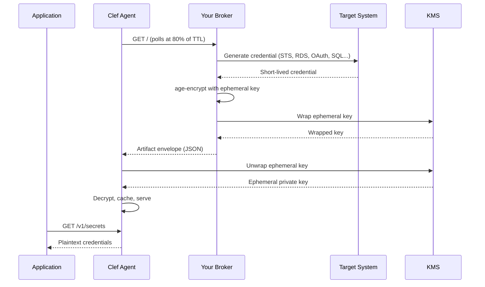

# Dynamic Secrets

Dynamic secrets are short-lived credentials generated on demand, rather than static values stored in encrypted files. They reduce blast radius — a leaked credential expires before an attacker can use it — and eliminate the need for manual rotation.

Clef provides two paths to dynamic secrets:

1. **Broker SDK** (`@clef-sh/broker`) — a runtime harness that handles envelope construction, KMS wrapping, and HTTP serving. You write a `create()` function; the SDK does the rest. Start here.
2. **Manual envelope** — build the artifact envelope yourself in any language. Full control, no SDK dependency. See [Building envelopes manually](#building-envelopes-manually) below.

## Quick start with the Broker SDK

### Install a broker from the registry

The [Clef Broker Registry](https://registry.clef.sh) provides ready-made broker templates for common credential sources.

```bash
# Browse available brokers
clef search

# Install one
clef install sts-assume-role
```

This downloads `broker.yaml`, `handler.ts`, and `README.md` into `brokers/sts-assume-role/` in your project. The handler is the complete credential logic — typically 15-30 lines.

### Available official brokers

| Broker                                                                                  | Provider | Tier | Description                                                                   |
| --------------------------------------------------------------------------------------- | -------- | ---- | ----------------------------------------------------------------------------- |
| [`sts-assume-role`](https://registry.clef.sh/brokers/sts-assume-role)                   | AWS      | 1    | Temporary AWS credentials via STS AssumeRole                                  |
| [`rds-iam`](https://registry.clef.sh/brokers/rds-iam)                                   | AWS      | 1    | RDS IAM auth tokens (15-minute TTL)                                           |
| [`oauth-client-credentials`](https://registry.clef.sh/brokers/oauth-client-credentials) | Agnostic | 1    | OAuth2 access tokens — one broker for hundreds of SaaS APIs                   |
| [`sql-database`](https://registry.clef.sh/brokers/sql-database)                         | Agnostic | 2    | Ephemeral SQL users via Handlebars templates (Postgres, MySQL, MSSQL, Oracle) |

### Write a custom broker

If the registry doesn't have what you need, write your own. A broker is a `create()` function:

```typescript
import type { BrokerHandler } from "@clef-sh/broker";
import { Signer } from "@aws-sdk/rds-signer";

export const handler: BrokerHandler = {
  create: async (config) => {
    const signer = new Signer({
      hostname: config.DB_ENDPOINT,
      port: Number(config.DB_PORT ?? "5432"),
      username: config.DB_USER,
    });
    return {
      data: { DB_TOKEN: await signer.getAuthToken() },
      ttl: 900,
    };
  },
};
```

That's the entire broker. The `@clef-sh/broker` package handles:

- Ephemeral age key generation and encryption
- KMS wrapping of the ephemeral private key
- JSON envelope construction with integrity hashing
- Response caching (80% of TTL)
- HTTP serving or Lambda response formatting

### Deploy

Use `createHandler()` to get a stateful invoker with caching, revocation, and graceful shutdown:

::: code-group

```typescript [Lambda]
import { createHandler } from "@clef-sh/broker";
import { handler } from "./handler";

const broker = createHandler(handler);

// Lambda entry point
export const lambdaHandler = () => broker.invoke();

// Clean up on SIGTERM (Lambda sends this before shutdown)
process.on("SIGTERM", () => broker.shutdown());
```

```typescript [Container / VM]
import { serve } from "@clef-sh/broker";
import { handler } from "./handler";

// Starts an HTTP server on 0.0.0.0:8080
await serve(handler);
```

```typescript [Express / Fastify]
import { createHandler } from "@clef-sh/broker";
import { handler } from "./handler";

const broker = createHandler(handler);

app.get("/", async (req, res) => {
  const result = await broker.invoke();
  res.status(result.statusCode).set(result.headers).send(result.body);
});
```

:::

Configure via environment variables:

```bash
CLEF_BROKER_IDENTITY=api-gateway        # Envelope identity
CLEF_BROKER_ENVIRONMENT=production       # Envelope environment
CLEF_BROKER_KMS_PROVIDER=aws            # aws | gcp | azure
CLEF_BROKER_KMS_KEY_ID=arn:aws:kms:...  # KMS key for wrapping

# Handler-specific config (prefix stripped, passed to create())
CLEF_BROKER_HANDLER_DB_ENDPOINT=mydb.cluster-abc.rds.amazonaws.com
CLEF_BROKER_HANDLER_DB_USER=clef_readonly
CLEF_BROKER_HANDLER_DB_PORT=5432
```

### Point the agent at the broker

The agent treats the broker URL like any other artifact source:

```bash
export CLEF_AGENT_SOURCE=https://your-broker-function-url.lambda-url.us-east-1.on.aws/
clef-agent
```

The agent polls the URL, receives the envelope, unwraps via KMS, decrypts, and serves. Your application reads secrets from `127.0.0.1:7779` as usual.

## The contract

The agent fetches a URL and expects a JSON response matching the artifact envelope schema:

```json
{
  "version": 1,
  "identity": "api-gateway",
  "environment": "production",
  "packedAt": "2026-03-22T00:00:00.000Z",
  "revision": "1711065600000-a1b2c3d4",
  "ciphertextHash": "sha256-hex-digest",
  "ciphertext": "base64-encoded-age-ciphertext",
  "expiresAt": "2026-03-22T01:00:00.000Z",
  "envelope": {
    "provider": "aws",
    "keyId": "arn:aws:kms:us-east-1:...",
    "wrappedKey": "base64-wrapped-ephemeral-key",
    "algorithm": "SYMMETRIC_DEFAULT"
  }
}
```

| Field            | Required | Description                                                                                               |
| ---------------- | -------- | --------------------------------------------------------------------------------------------------------- |
| `version`        | Yes      | Always `1`                                                                                                |
| `identity`       | Yes      | Service identity name                                                                                     |
| `environment`    | Yes      | Target environment                                                                                        |
| `packedAt`       | Yes      | ISO-8601 timestamp when the credential was minted                                                         |
| `revision`       | Yes      | Monotonically increasing revision for change detection                                                    |
| `ciphertextHash` | Yes      | SHA-256 hex digest of `ciphertext` for integrity checking                                                 |
| `ciphertext`     | Yes      | Base64-encoded age-encrypted blob containing the secret key-value pairs                                   |
| `expiresAt`      | No       | ISO-8601 expiry. Agent rejects the artifact after this time                                               |
| `revokedAt`      | No       | ISO-8601 revocation timestamp. Agent wipes cache and returns 503                                          |
| `envelope`       | No       | KMS wrapper — when present, the agent unwraps the ephemeral key via KMS instead of using a static age key |

### How the agent uses `expiresAt`

When `expiresAt` is present, the agent schedules a refresh at **80% of the remaining lifetime**. For a 1-hour credential, the agent re-fetches at ~48 minutes. This ensures the application always has a valid credential, with a comfortable margin before expiry.

If the refresh fails, the agent retries with exponential backoff. If the credential expires before a successful refresh, the agent wipes its cache and returns 503 on all secrets endpoints — your application gets a clear failure signal rather than a stale credential.

## Broker tiers

| Tier  | Credential type   | Revocation                                 | Examples                                                               |
| ----- | ----------------- | ------------------------------------------ | ---------------------------------------------------------------------- |
| **1** | Self-expiring     | None needed — credentials expire naturally | STS AssumeRole, RDS IAM tokens, OAuth access tokens, GCP access tokens |
| **2** | Stateful          | Create-new, revoke-previous                | SQL database users, MongoDB users, Redis ACL users                     |
| **3** | Complex lifecycle | Multi-step teardown                        | IAM users, LDAP, K8s RBAC                                              |

Tier 1 brokers only implement `create()`. Tier 2 brokers also implement `revoke()` — the SDK calls `revoke(previousEntityId)` automatically before each new `create()`, and on `shutdown()`.

## Architecture



The broker is any HTTP endpoint — Lambda, Cloud Function, container, VM. The agent is unchanged — it fetches a URL, validates the envelope, decrypts, and serves. Your broker is the only new component, and you own it entirely.

## Revocation

Dynamic endpoints handle revocation natively. When the broker decides access should be denied, it returns a revocation envelope:

```json
{
  "version": 1,
  "identity": "api-gateway",
  "environment": "production",
  "revokedAt": "2026-03-22T12:00:00.000Z"
}
```

The agent detects `revokedAt`, immediately wipes its in-memory and disk caches, and returns 503 on all secrets endpoints. No separate revocation mechanism — the endpoint IS the policy enforcer.

## Security

### Authenticate agent requests

Use Lambda function URLs with IAM authentication. The agent's runtime role must have `lambda:InvokeFunctionUrl` permission on the specific function:

```json
{
  "Version": "2012-10-17",
  "Statement": [
    {
      "Effect": "Allow",
      "Action": "lambda:InvokeFunctionUrl",
      "Resource": "arn:aws:lambda:us-east-1:123456789012:function:clef-sts-broker",
      "Condition": {
        "StringEquals": {
          "lambda:FunctionUrlAuthType": "AWS_IAM"
        }
      }
    }
  ]
}
```

::: warning Do not use unauthenticated function URLs
An unauthenticated function URL means anyone who discovers the URL can mint credentials. Always use IAM authentication for dynamic secret endpoints.
:::

### Per-identity IAM roles

Each service identity should assume a scoped IAM role at runtime with minimum permissions:

- `lambda:InvokeFunctionUrl` on the specific broker Lambda
- `kms:Decrypt` on the KMS key used in the `envelope`
- No other permissions

### Audit trail

Every credential mint is traceable:

- **CloudTrail** logs the Lambda invocation (who called, when, from where)
- **CloudTrail** logs the `sts:AssumeRole` or `rds-signer:GetAuthToken` call inside the Lambda
- **KMS audit logs** trace every key wrap and unwrap operation
- **Agent telemetry** (OTLP) logs artifact refresh events with revision and key count

No Clef infrastructure sits in the audit path — all logs are in your AWS account.

## Beyond AWS

The same pattern applies to any cloud or platform:

| Cloud | Function       | Authentication        | Credential source                    |
| ----- | -------------- | --------------------- | ------------------------------------ |
| AWS   | Lambda         | IAM function URL auth | STS, RDS Signer, Secrets Manager     |
| GCP   | Cloud Function | Workload Identity     | Service Account Keys, Secret Manager |
| Azure | Azure Function | Managed Identity      | Key Vault, Managed Identity tokens   |

The agent doesn't know which cloud is behind the URL. It fetches, validates the envelope, decrypts, and serves. Your broker handles authentication and credential minting using whatever platform-native tools are available.

## Building envelopes manually

If you prefer to build the artifact envelope without the `@clef-sh/broker` SDK — in a different language, in a custom framework, or for maximum control — the steps are:

1. Generate your credential (STS, RDS IAM, OAuth, database user, etc.)
2. `JSON.stringify` the credentials as key-value pairs
3. Generate an ephemeral age key pair
4. age-encrypt the plaintext to the ephemeral public key
5. Base64-encode the ciphertext
6. Wrap the ephemeral private key with KMS
7. Compute SHA-256 of the base64 ciphertext
8. Return the JSON envelope with all fields

::: details Full manual Lambda example (STS + KMS envelope)

```javascript
import { STSClient, AssumeRoleCommand } from "@aws-sdk/client-sts";
import { KMSClient, EncryptCommand } from "@aws-sdk/client-kms";
import { Encrypter, generateIdentity, identityToRecipient } from "age-encryption";
import { createHash, randomBytes } from "node:crypto";

const sts = new STSClient({});
const kms = new KMSClient({});

const IDENTITY = process.env.CLEF_IDENTITY;
const ENVIRONMENT = process.env.CLEF_ENVIRONMENT;
const TARGET_ROLE_ARN = process.env.TARGET_ROLE_ARN;
const KMS_KEY_ID = process.env.KMS_KEY_ID;
const TTL_SECONDS = parseInt(process.env.TTL_SECONDS || "3600", 10);

export async function handler(event) {
  const { Credentials } = await sts.send(
    new AssumeRoleCommand({
      RoleArn: TARGET_ROLE_ARN,
      RoleSessionName: `clef-${IDENTITY}-${Date.now()}`,
      DurationSeconds: TTL_SECONDS,
    }),
  );

  const payload = JSON.stringify({
    AWS_ACCESS_KEY_ID: Credentials.AccessKeyId,
    AWS_SECRET_ACCESS_KEY: Credentials.SecretAccessKey,
    AWS_SESSION_TOKEN: Credentials.SessionToken,
  });

  // Ephemeral age key pair — unique per request
  const ephemeralPrivateKey = await generateIdentity();
  const ephemeralPublicKey = await identityToRecipient(ephemeralPrivateKey);

  const encrypter = new Encrypter();
  encrypter.addRecipient(ephemeralPublicKey);
  const encrypted = await encrypter.encrypt(payload);
  const ciphertext = Buffer.from(encrypted).toString("base64");

  // Wrap ephemeral private key with KMS
  const { CiphertextBlob } = await kms.send(
    new EncryptCommand({
      KeyId: KMS_KEY_ID,
      Plaintext: Buffer.from(ephemeralPrivateKey),
    }),
  );

  const now = new Date();
  return {
    statusCode: 200,
    headers: { "Content-Type": "application/json" },
    body: JSON.stringify({
      version: 1,
      identity: IDENTITY,
      environment: ENVIRONMENT,
      packedAt: now.toISOString(),
      revision: `${now.getTime()}-${randomBytes(4).toString("hex")}`,
      ciphertextHash: createHash("sha256").update(ciphertext).digest("hex"),
      ciphertext,
      keys: ["AWS_ACCESS_KEY_ID", "AWS_SECRET_ACCESS_KEY", "AWS_SESSION_TOKEN"],
      expiresAt: new Date(now.getTime() + TTL_SECONDS * 1000).toISOString(),
      envelope: {
        provider: "aws",
        keyId: KMS_KEY_ID,
        wrappedKey: Buffer.from(CiphertextBlob).toString("base64"),
        algorithm: "SYMMETRIC_DEFAULT",
      },
    }),
  };
}
```

:::

## See also

- [Broker Registry](https://registry.clef.sh) — browse and install broker templates
- [Runtime Agent](/guide/agent) — agent configuration and deployment models
- [Service Identities](/guide/service-identities) — creating identities and packing artifacts
- [`clef pack`](/cli/pack) — CLI reference for the pack command
- [Production Isolation](/guide/production-isolation) — hardening runtime deployments
- [Contributing a broker](https://registry.clef.sh/contributing) — how to add a broker to the registry
