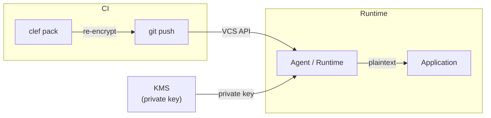

# Service Identities

Service identities let serverless functions, containers, and other machine workloads consume Clef-managed secrets at runtime — without git, without the `sops` binary, and without storing private keys in deployment artifacts. A service identity is a named, scoped set of per-environment age key pairs declared in `clef.yaml`.

At build time, `clef pack` creates a portable JSON artifact with age-encrypted secrets. At runtime the [Clef Agent](/guide/agent) fetches the artifact, decrypts in memory, and serves secrets via a localhost HTTP API — no language-specific SDK required.

## When to use service identities

Use a service identity when:

- Your workload runs in a serverless environment (Lambda, Cloud Functions, Cloud Run) with no access to `sops` or git
- You want to avoid bundling the `sops` binary in your deployment artifact
- You need namespace-scoped access control — the workload should only decrypt the namespaces it owns
- You want drift detection between the manifest and the actual recipients on encrypted files

If your workload has access to git and `sops`, you can continue using [`clef exec`](/cli/exec) or [`clef export`](/cli/export) instead.

## How it works



1. **`clef service create`** generates an age key pair per environment, registers the public keys as SOPS recipients on scoped files, and prints the private keys once
2. The operator stores each private key in the environment's secret manager (e.g. AWS Secrets Manager) — or wraps it with a cloud KMS key
3. **`clef pack`** decrypts scoped SOPS files, age-encrypts all values as a single blob to the environment's public key, and writes a JSON artifact
4. **CI commits** the artifact to `.clef/packed/{identity}/{environment}.age` in git
5. At runtime, the **agent** or **`@clef-sh/runtime`** fetches the artifact via the VCS provider API, decrypts in memory with the private key, and serves secrets

### Two separate key pairs

The security model relies on a clean separation between two independent key pairs:

| Key pair                  | Held by               | Purpose                                              |
| ------------------------- | --------------------- | ---------------------------------------------------- |
| **Team / deploy keys**    | Developers and CI     | Decrypt SOPS files (the repo's encrypted secrets)    |
| **Service identity keys** | Runtime workload only | Decrypt packed artifacts scoped to a single identity |

The flow through both key pairs:

```
SOPS files (encrypted to team age keys)
    ↓  CI decrypts with deploy key
Plaintext secrets (in memory, never on disk)
    ↓  clef pack re-encrypts to service identity's PUBLIC key
Packed artifact (ciphertext only, committed to git)
    ↓  Agent fetches via VCS API
    ↓  Decrypts with service identity's PRIVATE key
Plaintext secrets (in memory, served via localhost)
```

This separation means the CI runner can pack artifacts for any service identity without ever holding that identity's private key. And the service identity can only decrypt the namespaces it was scoped to, not the entire repo.

## Manifest schema

```yaml
version: 1

environments:
  - name: dev
    description: Local development
  - name: staging
    description: Pre-production
  - name: production
    description: Production
    protected: true

namespaces:
  - name: api
    description: API secrets
  - name: database
    description: Database credentials

sops:
  default_backend: age

file_pattern: "{namespace}/{environment}.enc.yaml"

service_identities:
  - name: api-gateway
    description: "API gateway service"
    namespaces: [api]
    environments:
      dev:
        recipient: age1dev...
      staging:
        recipient: age1stg...
      production:
        recipient: age1prd...
```

### Rules

- `service_identities` is optional — existing manifests without it continue to work unchanged
- Each identity must cover **all** declared environments
- Namespace scope must reference existing namespaces
- The `recipient` is an age public key — the private key's storage is the deployer's concern
- Identity names must be unique

## Creating a service identity

```bash
clef service create api-gateway \
  --namespaces api \
  --description "API gateway service"
```

Generates an age key pair per environment, updates `clef.yaml`, registers the public keys as SOPS recipients on the scoped files, and prints the private keys once:

```
✓  Service identity 'api-gateway' created.

  Namespaces: api
  Environments: dev, staging, production

⚠  Private keys are shown ONCE. Store them securely (e.g. AWS Secrets Manager, Vault).

  dev:
    AGE-SECRET-KEY-1QPZRY9X8GF2TVDW0S3JN54KHCE6MUA7L...

  staging:
    AGE-SECRET-KEY-1X8GF2TVDW0S3JN54KHCE6MUA7LQPZRY9...

  production:
    AGE-SECRET-KEY-1GF2TVDW0S3JN54KHCE6MUA7LQPZRY9X8...

→  git add clef.yaml && git commit -m "feat: add service identity 'api-gateway'"
```

::: warning Store private keys immediately
Private keys are printed once. Copy each key to the appropriate secret manager before closing the terminal. If you lose a key, use `clef service rotate` to generate a replacement.
:::

Commit the updated manifest after creating the identity:

```bash
git add clef.yaml && git add -A && git commit -m "feat: add service identity 'api-gateway'"
```

### Multi-namespace identities

For a service that needs secrets from multiple namespaces:

```bash
clef service create backend-api \
  --namespaces api,database \
  --description "Backend API server"
```

Keys from multi-namespace artifacts are prefixed with the namespace to avoid collisions:

```
api/STRIPE_KEY
database/DB_HOST
```

Single-namespace identities use bare keys:

```
STRIPE_KEY
```

## Managing service identities

### Listing identities

```bash
clef service list
```

```
Name          Namespaces    Environments
────────────  ────────────  ────────────────────────────────────
api-gateway   api           dev: age1…jn54khce, staging: age1…y9x8gf2t, production: age1…w0s3jn5
```

### Showing details

```bash
clef service show api-gateway
```

### Rotating keys

Generates new age keys, removing the old ones from SOPS recipients:

```bash
# Rotate all environments
clef service rotate api-gateway

# Rotate a specific environment
clef service rotate api-gateway --environment production
```

New private keys are printed to stdout — store them immediately and re-pack artifacts after rotation.

## Packing artifacts

```bash
clef pack api-gateway production \
  --output ./artifact.json
```

The `pack` command decrypts all scoped SOPS files, age-encrypts the merged values as a single blob to the identity's public key, and writes a JSON artifact. Commit the artifact to `.clef/packed/` in your repository so the agent can fetch it via the VCS API at runtime.

## AWS Lambda walkthrough

Complete example using Clef service identities with AWS Lambda.

### 1. Prerequisites

- A Clef repository with an `api` namespace and `production` environment
- An AWS account with Secrets Manager and Lambda access

### 2. Create the service identity

```bash
clef service create api-lambda \
  --namespaces api \
  --description "Production API Lambda"
```

Copy the `production` private key from the output.

### 3. Store the private key in AWS Secrets Manager

```bash
aws secretsmanager create-secret \
  --name clef/api-lambda/production \
  --secret-string "AGE-SECRET-KEY-1..." \
  --description "Clef service identity private key for api-lambda"
```

Grant your Lambda execution role permission to read this secret:

```json
{
  "Version": "2012-10-17",
  "Statement": [
    {
      "Effect": "Allow",
      "Action": "secretsmanager:GetSecretValue",
      "Resource": "arn:aws:secretsmanager:us-east-1:123456789012:secret:clef/api-lambda/production-*"
    }
  ]
}
```

### 4. Pack and commit in CI

```yaml
# .github/workflows/pack.yml
name: Pack Secrets
on:
  push:
    branches: [main]

jobs:
  pack:
    runs-on: ubuntu-latest
    steps:
      - uses: actions/checkout@v4

      - uses: actions/setup-node@v4
        with:
          node-version: 22

      - name: Install dependencies
        run: npm ci

      - name: Pack secrets artifact
        env:
          CLEF_AGE_KEY: ${{ secrets.CLEF_DEPLOY_KEY }}
        run: |
          npx @clef-sh/cli pack api-lambda production \
            --output .clef/packed/api-lambda/production.age

      - name: Commit packed artifact
        run: |
          git config user.name "github-actions[bot]"
          git config user.email "41898282+github-actions[bot]@users.noreply.github.com"
          git add .clef/packed/
          git commit -m "chore: pack api-lambda/production" || echo "No changes"
          git push
```

::: info Why does the CI runner need a deploy key?
The `clef pack` command must decrypt SOPS files to re-encrypt them for the service identity. The CI runner needs a key that can decrypt the `api` namespace in the `production` environment — this is the same `CLEF_AGE_KEY` you would use for `clef exec`. The service identity's own private key is not used during packing.
:::

### 5. Use `@clef-sh/runtime` in your Lambda handler

Import `@clef-sh/runtime` directly — no sidecar, no Extension, no extra process. The runtime fetches the packed artifact from GitHub on cold start and caches it in memory:

```bash
npm install @clef-sh/runtime
```

```javascript
// index.mjs
import { init } from "@clef-sh/runtime";

let runtime;

export async function handler(event) {
  if (!runtime) {
    runtime = await init({
      provider: "github",
      repo: "org/secrets",
      identity: "api-lambda",
      environment: "production",
      token: process.env.CLEF_VCS_TOKEN,
      ageKey: process.env.CLEF_AGE_KEY,
      cachePath: "/tmp/.clef-cache",
    });
  }

  const dbUrl = runtime.get("DATABASE_URL");
  const apiKey = runtime.get("STRIPE_KEY");

  return {
    statusCode: 200,
    body: JSON.stringify({ ok: true }),
  };
}
```

Set `CLEF_VCS_TOKEN` and `CLEF_AGE_KEY` as Lambda environment variables (encrypted via AWS console or SSM). The `cachePath` enables disk fallback so subsequent warm invocations survive transient GitHub API failures.

## Drift detection

`clef lint` automatically checks service identity configurations when `service_identities` is present in the manifest:

| Rule                       | Severity | Trigger                                                         |
| -------------------------- | -------- | --------------------------------------------------------------- |
| `missing_environment`      | error    | Identity does not cover all declared environments               |
| `namespace_not_found`      | error    | Identity references a non-existent namespace                    |
| `recipient_not_registered` | warning  | Identity's public key is not in a scoped SOPS file's recipients |
| `scope_mismatch`           | warning  | Identity's key found as recipient outside its namespace scope   |

These rules catch configuration drift after manifest changes, team member rotations, or manual edits to encrypted files.

## Security model

### What the artifact contains

The packed artifact contains:

- **Age-encrypted ciphertext** — the secrets blob encrypted to the service identity's public key. Cannot be decrypted without the corresponding private key.
- **Key names in plaintext** — the `keys` array lists available secret names for introspection. Key names are not considered secret data.
- **No plaintext private keys** — the private key is never embedded. It is fetched at runtime from a secret manager or provided as an environment variable.

### Trust boundaries

| Component            | Contains secrets?                   | Needs git? | Needs sops? |
| -------------------- | ----------------------------------- | ---------- | ----------- |
| Developer machine    | Plaintext (in memory via sops)      | Yes        | Yes         |
| CI runner            | Plaintext (in memory during pack)   | Yes        | Yes         |
| Packed artifact      | Ciphertext only                     | No         | No          |
| Runtime (Agent)      | Plaintext (in memory after decrypt) | No         | No          |
| Secret manager / KMS | Private key (plaintext or wrapped)  | No         | No          |

### No custom crypto

Runtime decryption uses [age-encryption](https://www.npmjs.com/package/age-encryption). Clef implements no cryptographic primitives — all encryption and decryption is delegated to established libraries.

## See also

- [`clef service`](/cli/service) — CLI reference for service identity commands
- [`clef pack`](/cli/pack) — CLI reference for the pack command
- [Runtime Agent](/guide/agent) — sidecar agent for secret rotation without redeployment
- [Team Setup](/guide/team-setup) — adding human recipients
- [CI/CD Integration](/guide/ci-cd) — using `clef exec` in CI pipelines
- [Manifest Reference](/guide/manifest) — full manifest field reference
