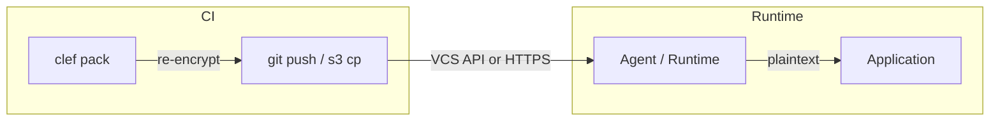

# Service Identities

Service identities let serverless functions, containers, and other machine workloads consume Clef-managed secrets at runtime — without git, without the `sops` binary, and without storing private keys in deployment artifacts. A service identity is a named, scoped set of per-environment credentials declared in `clef.yaml`.

At build time, `clef pack` creates a portable JSON artifact with age-encrypted secrets. At runtime the [Clef Agent](/guide/agent) fetches the artifact, decrypts in memory, and serves secrets via a localhost HTTP API — no language-specific SDK required.

## When to use service identities

Use a service identity when:

- Your workload runs in a serverless environment (Lambda, Cloud Functions, Cloud Run) with no access to `sops` or git
- You want to avoid bundling the `sops` binary in your deployment artifact
- You need namespace-scoped access control — the workload should only decrypt the namespaces it owns
- You want drift detection between the manifest and the actual recipients on encrypted files

If your workload has access to git and `sops`, you can continue using [`clef exec`](/cli/exec) or [`clef export`](/cli/export) instead.

## How it works



1. **`clef service create`** provisions per-environment credentials (age keys or KMS envelope config) and registers the identity in `clef.yaml`
2. **`clef pack`** decrypts scoped SOPS files, age-encrypts all values as a single blob, and writes a JSON artifact
3. **CI delivers** the artifact — either by committing to git (VCS backend) or uploading to an object store (tokenless backend)
4. At runtime, the **agent** or **`@clef-sh/runtime`** fetches the artifact, decrypts in memory, and serves secrets

### Two encryption modes

| Mode                   | How it works                                                                                                                                                                   | Runtime credentials                             |
| ---------------------- | ------------------------------------------------------------------------------------------------------------------------------------------------------------------------------ | ----------------------------------------------- |
| **Age-only** (default) | `clef service create` generates persistent age key pairs. The private key is stored in your secret manager.                                                                    | VCS token + age private key                     |
| **KMS envelope**       | `clef service create --kms-env` uses cloud KMS. At pack time, an ephemeral age key encrypts secrets; the ephemeral private key is wrapped by KMS and embedded in the artifact. | VCS token + IAM identity (no age key to manage) |

### Two artifact delivery backends

Clef supports two ways to deliver packed artifacts to your runtime. Both work with either encryption mode.

|                            | VCS (default)                                                                  | Tokenless (HTTP/S3)                                                                                                                    |
| -------------------------- | ------------------------------------------------------------------------------ | -------------------------------------------------------------------------------------------------------------------------------------- |
| **How it works**           | Artifact is committed to git. Runtime fetches via GitHub/GitLab/Bitbucket API. | Artifact is uploaded to S3, GCS, or any HTTPS endpoint. Runtime fetches via HTTP.                                                      |
| **Runtime credentials**    | VCS token (GitHub PAT, GitLab PAT, etc.)                                       | IAM role (S3) or none (presigned URL)                                                                                                  |
| **CI step**                | `clef pack` + `git push`                                                       | `clef pack` + `aws s3 cp` (or equivalent)                                                                                              |
| **Operational complexity** | Lower — artifact lives in the same repo, no extra infra                        | Higher — separate bucket, lifecycle policies, IAM permissions                                                                          |
| **Token management**       | VCS token must be provisioned and rotated                                      | No VCS token needed at runtime                                                                                                         |
| **Audit trail**            | Git history + VCS API access logs                                              | S3 access logs / CloudTrail                                                                                                            |
| **When to use**            | Default choice. Simplest path when your workload already has a VCS token.      | When you want to eliminate the VCS token from your runtime, or when your infrastructure already uses S3/GCS for artifact distribution. |

::: tip Choose based on your operational reality
**VCS** is the default because it requires no extra infrastructure — the artifact is just another file in git. **Tokenless** is the right choice when eliminating the VCS token matters more than the additional operational overhead of managing an object store. Both paths produce identical artifacts and the runtime handles both transparently.
:::

### Key separation

The security model relies on a clean separation between two independent key pairs:

| Key pair                  | Held by               | Purpose                                              |
| ------------------------- | --------------------- | ---------------------------------------------------- |
| **Team / deploy keys**    | Developers and CI     | Decrypt SOPS files (the repo's encrypted secrets)    |
| **Service identity keys** | Runtime workload only | Decrypt packed artifacts scoped to a single identity |

The flow through both key pairs:

```
SOPS files (encrypted to team age keys)
    ↓  CI decrypts with deploy key
Plaintext secrets (in memory, never on disk)
    ↓  clef pack re-encrypts to service identity's PUBLIC key
Packed artifact (ciphertext only)
    ↓  Agent fetches via VCS API or HTTP
    ↓  Decrypts with service identity's PRIVATE key (or KMS-unwrapped ephemeral key)
Plaintext secrets (in memory, served via localhost)
```

This separation means the CI runner can pack artifacts for any service identity without ever holding that identity's private key. And the service identity can only decrypt the namespaces it was scoped to, not the entire repo.

## Manifest schema

### Age-only identity (default)

```yaml
service_identities:
  - name: api-gateway
    description: "API gateway service"
    namespaces: [api]
    environments:
      dev:
        recipient: age1dev...
      staging:
        recipient: age1stg...
      production:
        recipient: age1prd...
```

### KMS envelope identity

```yaml
service_identities:
  - name: api-gateway
    description: "API gateway service"
    namespaces: [api]
    environments:
      dev:
        kms:
          provider: aws
          keyId: arn:aws:kms:us-east-1:111:key/dev-key-id
      staging:
        kms:
          provider: aws
          keyId: arn:aws:kms:us-east-1:222:key/stg-key-id
      production:
        kms:
          provider: aws
          keyId: arn:aws:kms:us-west-2:333:key/prd-key-id
          region: us-west-2
```

### Mixed (per-environment)

You can mix age-only and KMS within the same identity — for example, using age keys in dev/staging and KMS in production:

```yaml
service_identities:
  - name: api-gateway
    description: "API gateway service"
    namespaces: [api]
    environments:
      dev:
        recipient: age1dev...
      staging:
        recipient: age1stg...
      production:
        kms:
          provider: aws
          keyId: arn:aws:kms:us-west-2:333:key/prd-key-id
```

### Rules

- `service_identities` is optional — existing manifests without it continue to work unchanged
- Each identity must cover **all** declared environments
- Namespace scope must reference existing namespaces
- Each environment must have exactly one of `recipient` (age public key) or `kms` (KMS config) — not both
- Identity names must be unique

## Creating a service identity

### Age-only (default)

```bash
clef service create api-gateway \
  --namespaces api \
  --description "API gateway service"
```

Generates an age key pair per environment, updates `clef.yaml`, registers the public keys as SOPS recipients on the scoped files, and prints the private keys once:

```
✓  Service identity 'api-gateway' created.

  Namespaces: api
  Environments: dev, staging, production

⚠  Private keys are shown ONCE. Store them securely (e.g. AWS Secrets Manager, Vault).

  dev:
    AGE-SECRET-KEY-1QPZRY9X8GF2TVDW0S3JN54KHCE6MUA7L...

  staging:
    AGE-SECRET-KEY-1X8GF2TVDW0S3JN54KHCE6MUA7LQPZRY9...

  production:
    AGE-SECRET-KEY-1GF2TVDW0S3JN54KHCE6MUA7LQPZRY9X8...

→  git add clef.yaml && git commit -m "feat: add service identity 'api-gateway'"
```

::: warning Store private keys immediately
Private keys are printed once. Copy each key to the appropriate secret manager before closing the terminal. If you lose a key, use `clef service rotate` to generate a replacement.
:::

### KMS envelope

```bash
clef service create api-gateway \
  --namespaces api \
  --description "API gateway service" \
  --kms-env dev=aws:arn:aws:kms:us-east-1:111:key/dev-key \
  --kms-env staging=aws:arn:aws:kms:us-east-1:222:key/stg-key \
  --kms-env production=aws:arn:aws:kms:us-west-2:333:key/prd-key
```

No private keys are generated or printed — the KMS key handles encryption. At pack time, Clef generates an ephemeral age key pair, encrypts secrets to it, wraps the ephemeral private key with the KMS key, and embeds everything in the artifact. At runtime, the workload calls KMS Decrypt to unwrap the ephemeral key.

```
✓  Service identity 'api-gateway' created.

  Namespaces: api
  Environments: dev, staging, production

  dev: KMS envelope (aws) — no age keys generated.
  staging: KMS envelope (aws) — no age keys generated.
  production: KMS envelope (aws) — no age keys generated.

→  git add clef.yaml && git commit -m "feat: add service identity 'api-gateway'"
```

::: info No key rotation needed
KMS envelope identities use ephemeral age keys — a fresh key pair is generated every time you run `clef pack`. There is no persistent private key to rotate, provision, or lose.
:::

The `--kms-env` flag format is `environment=provider:keyId` and can be repeated. Supported providers: `aws` (fully implemented), `gcp` and `azure` (coming soon).

### Mixed mode

Use `--kms-env` for specific environments while letting the others use age keys:

```bash
clef service create api-gateway \
  --namespaces api \
  --kms-env production=aws:arn:aws:kms:us-west-2:333:key/prd-key
```

This generates age keys for `dev` and `staging` (printed once), but uses KMS for `production`.

Commit the updated manifest after creating the identity:

```bash
git add clef.yaml && git add -A && git commit -m "feat: add service identity 'api-gateway'"
```

### Multi-namespace identities

For a service that needs secrets from multiple namespaces:

```bash
clef service create backend-api \
  --namespaces api,database \
  --description "Backend API server"
```

Keys from multi-namespace artifacts are prefixed with the namespace to avoid collisions:

```
api/STRIPE_KEY
database/DB_HOST
```

Single-namespace identities use bare keys:

```
STRIPE_KEY
```

## Managing service identities

### Listing identities

```bash
clef service list
```

```
Name          Namespaces    Environments
────────────  ────────────  ────────────────────────────────────
api-gateway   api           dev: age1…jn54khce, staging: age1…y9x8gf2t, production: KMS (aws)
```

### Showing details

```bash
clef service show api-gateway
```

### Rotating keys

Generates new age keys, removing the old ones from SOPS recipients:

```bash
# Rotate all environments
clef service rotate api-gateway

# Rotate a specific environment
clef service rotate api-gateway --environment production
```

New private keys are printed to stdout — store them immediately and re-pack artifacts after rotation.

::: info KMS environments are skipped during rotation
KMS-backed environments have no persistent age key to rotate. `clef service rotate` only rotates age-only environments.
:::

## Packing artifacts

```bash
clef pack api-gateway production \
  --output ./artifact.json
```

The `pack` command decrypts all scoped SOPS files, age-encrypts the merged values as a single blob, and writes a JSON artifact. For KMS identities, the artifact is self-contained — the wrapped ephemeral key is embedded in the artifact itself.

## Artifact delivery

### VCS backend (default)

Commit the artifact to `.clef/packed/` in your repository so the agent can fetch it via the VCS API at runtime.

```yaml
# .github/workflows/pack.yml
name: Pack Secrets
on:
  push:
    branches: [main]

jobs:
  pack:
    runs-on: ubuntu-latest
    steps:
      - uses: actions/checkout@v4
      - uses: actions/setup-node@v4
        with:
          node-version: 22

      - name: Install dependencies
        run: npm ci

      - name: Pack secrets artifact
        env:
          CLEF_AGE_KEY: ${{ secrets.CLEF_DEPLOY_KEY }}
        run: |
          npx @clef-sh/cli pack api-gateway production \
            --output .clef/packed/api-gateway/production.age

      - name: Commit packed artifact
        run: |
          git config user.name "github-actions[bot]"
          git config user.email "41898282+github-actions[bot]@users.noreply.github.com"
          git add .clef/packed/
          git commit -m "chore: pack api-gateway/production" || echo "No changes"
          git push
```

::: info Why does the CI runner need a deploy key?
The `clef pack` command must decrypt SOPS files to re-encrypt them for the service identity. The CI runner needs a key that can decrypt the `api` namespace in the `production` environment — this is the same `CLEF_AGE_KEY` you would use for `clef exec`. The service identity's own private key is not used during packing.
:::

### Tokenless backend (S3/HTTP)

Upload the artifact to an object store instead of committing to git. The runtime fetches it via HTTPS — no VCS token needed.

```yaml
# .github/workflows/pack.yml
name: Pack Secrets
on:
  push:
    branches: [main]

jobs:
  pack:
    runs-on: ubuntu-latest
    permissions:
      id-token: write
      contents: read

    steps:
      - uses: actions/checkout@v4
      - uses: actions/setup-node@v4
        with:
          node-version: 22

      - name: Install dependencies
        run: npm ci

      - name: Pack secrets artifact
        env:
          CLEF_AGE_KEY: ${{ secrets.CLEF_DEPLOY_KEY }}
        run: |
          npx @clef-sh/cli pack api-gateway production \
            --output ./artifact.json

      - name: Configure AWS credentials
        uses: aws-actions/configure-aws-credentials@v4
        with:
          role-to-assume: arn:aws:iam::123456789012:role/clef-pack-upload
          aws-region: us-east-1

      - name: Upload to S3
        run: |
          aws s3 cp ./artifact.json \
            s3://my-secrets-bucket/clef/api-gateway/production.json \
            --sse AES256
```

At runtime, point the agent at the HTTPS URL:

```bash
export CLEF_AGENT_SOURCE=https://my-secrets-bucket.s3.amazonaws.com/clef/api-gateway/production.json
export CLEF_AGENT_AGE_KEY=AGE-SECRET-KEY-1...

clef-agent
```

::: warning S3 bucket security
The artifact contains age-encrypted ciphertext, not plaintext secrets. However, treat the bucket as sensitive: enable server-side encryption, restrict access to the CI upload role and the runtime IAM role, and enable access logging.
:::

## AWS Lambda walkthrough

Complete example using Clef service identities with AWS Lambda.

### 1. Prerequisites

- A Clef repository with an `api` namespace and `production` environment
- An AWS account with KMS, Secrets Manager, and Lambda access

### 2. Create the service identity

**Age-only (store private key in Secrets Manager):**

```bash
clef service create api-lambda \
  --namespaces api \
  --description "Production API Lambda"
```

Copy the `production` private key from the output, then store it:

```bash
aws secretsmanager create-secret \
  --name clef/api-lambda/production \
  --secret-string "AGE-SECRET-KEY-1..." \
  --description "Clef service identity private key for api-lambda"
```

Grant your Lambda execution role permission to read this secret:

```json
{
  "Version": "2012-10-17",
  "Statement": [
    {
      "Effect": "Allow",
      "Action": "secretsmanager:GetSecretValue",
      "Resource": "arn:aws:secretsmanager:us-east-1:123456789012:secret:clef/api-lambda/production-*"
    }
  ]
}
```

**KMS envelope (no private key to store):**

```bash
clef service create api-lambda \
  --namespaces api \
  --description "Production API Lambda" \
  --kms-env production=aws:arn:aws:kms:us-east-1:123456789012:key/your-key-id
```

Grant your Lambda execution role permission to call KMS Decrypt:

```json
{
  "Version": "2012-10-17",
  "Statement": [
    {
      "Effect": "Allow",
      "Action": "kms:Decrypt",
      "Resource": "arn:aws:kms:us-east-1:123456789012:key/your-key-id"
    }
  ]
}
```

No secret to provision, no private key to rotate. The audit trail is a single CloudTrail line: "this Lambda role called KMS Decrypt on this key at this time."

### 3. Pack and deliver in CI

See the [VCS backend](#vcs-backend-default) or [Tokenless backend](#tokenless-backend-s3http) CI examples above.

### 4. Use `@clef-sh/runtime` in your Lambda handler

Import `@clef-sh/runtime` directly — no sidecar, no Extension, no extra process. The runtime fetches the packed artifact on cold start and caches it in memory:

```bash
npm install @clef-sh/runtime
```

**VCS backend (with token):**

```javascript
// index.mjs
import { init } from "@clef-sh/runtime";

let runtime;

export async function handler(event) {
  if (!runtime) {
    runtime = await init({
      provider: "github",
      repo: "org/secrets",
      identity: "api-lambda",
      environment: "production",
      token: process.env.CLEF_VCS_TOKEN,
      ageKey: process.env.CLEF_AGE_KEY, // not needed for KMS envelope
      cachePath: "/tmp/.clef-cache",
    });
  }

  const dbUrl = runtime.get("DATABASE_URL");
  const apiKey = runtime.get("STRIPE_KEY");

  return {
    statusCode: 200,
    body: JSON.stringify({ ok: true }),
  };
}
```

**Tokenless backend (S3, no token, no age key):**

```javascript
// index.mjs — KMS envelope + S3 source
import { init } from "@clef-sh/runtime";

let runtime;

export async function handler(event) {
  if (!runtime) {
    runtime = await init({
      source: "https://my-secrets-bucket.s3.amazonaws.com/clef/api-lambda/production.json",
      cachePath: "/tmp/.clef-cache",
    });
    // No token, no age key — the artifact is self-describing.
    // The runtime calls KMS Decrypt using the Lambda's IAM role.
  }

  const dbUrl = runtime.get("DATABASE_URL");
  return { statusCode: 200, body: JSON.stringify({ ok: true }) };
}
```

Set environment variables as Lambda configuration (encrypted via AWS console or SSM). The `cachePath` enables disk fallback so subsequent warm invocations survive transient API failures.

## Drift detection

`clef lint` automatically checks service identity configurations when `service_identities` is present in the manifest:

| Rule                       | Severity | Trigger                                                         |
| -------------------------- | -------- | --------------------------------------------------------------- |
| `missing_environment`      | error    | Identity does not cover all declared environments               |
| `namespace_not_found`      | error    | Identity references a non-existent namespace                    |
| `recipient_not_registered` | warning  | Identity's public key is not in a scoped SOPS file's recipients |
| `scope_mismatch`           | warning  | Identity's key found as recipient outside its namespace scope   |

KMS-backed environments skip recipient checks — there is no age public key registered as a SOPS recipient.

These rules catch configuration drift after manifest changes, team member rotations, or manual edits to encrypted files.

## Security model

### What the artifact contains

**Age-only artifact:**

- Age-encrypted ciphertext — the secrets blob encrypted to the service identity's public key
- Key names in plaintext — the `keys` array lists available secret names for introspection
- No private keys

**KMS envelope artifact:**

- Age-encrypted ciphertext — encrypted to an ephemeral public key
- KMS-wrapped ephemeral private key — can only be unwrapped by calling KMS Decrypt with the correct IAM role
- KMS metadata (provider, key ARN, algorithm) in the `envelope` field
- Key names in plaintext

### Trust boundaries

| Component            | Contains secrets?                   | Needs git? | Needs sops? |
| -------------------- | ----------------------------------- | ---------- | ----------- |
| Developer machine    | Plaintext (in memory via sops)      | Yes        | Yes         |
| CI runner            | Plaintext (in memory during pack)   | Yes        | Yes         |
| Packed artifact      | Ciphertext only                     | No         | No          |
| Runtime (Agent)      | Plaintext (in memory after decrypt) | No         | No          |
| Secret manager / KMS | Private key (plaintext or wrapped)  | No         | No          |

### No custom crypto

Runtime decryption uses [age-encryption](https://www.npmjs.com/package/age-encryption). KMS envelope encryption delegates key wrapping to AWS KMS. Clef implements no cryptographic primitives.

## See also

- [`clef service`](/cli/service) — CLI reference for service identity commands
- [`clef pack`](/cli/pack) — CLI reference for the pack command
- [Runtime Agent](/guide/agent) — sidecar agent for secret rotation without redeployment
- [Team Setup](/guide/team-setup) — adding human recipients
- [CI/CD Integration](/guide/ci-cd) — using `clef exec` in CI pipelines
- [Manifest Reference](/guide/manifest) — full manifest field reference
