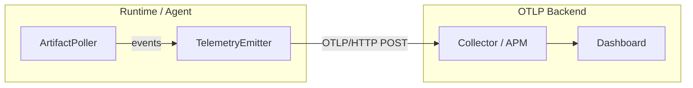

# Telemetry

Clef emits structured telemetry events via [OTLP](https://opentelemetry.io/docs/specs/otlp/) (OpenTelemetry Protocol) over HTTP. Events cover the full lifecycle — artifact refreshes, revocations, expiry, fetch failures, and agent start/stop. Point the endpoint at any OTLP-compatible backend: Grafana, Datadog, Honeycomb, a self-hosted OTel Collector, or Clef Cloud.

## When to use telemetry

- **CISO governance**: which identities are running, are credentials fresh, any revocations
- **On-call alerting**: fetch failures, cache expiry, revoked artifacts
- **Audit trail**: every artifact refresh with revision, key count, and encryption mode
- **Fleet visibility**: multiple agents across services and environments reporting to one place

## How it works



1. The poller emits events as secrets are fetched, refreshed, revoked, or expired
2. The `TelemetryEmitter` buffers events and flushes them as OTLP LogRecords via HTTP POST
3. Your OTLP backend receives standard `ExportLogsServiceRequest` payloads — no custom protocol

The emitter lives in `@clef-sh/runtime` with zero external dependencies. It constructs OTLP JSON by hand using built-in `fetch()` — no OpenTelemetry SDK, no protobuf.

## Setup

### Authentication

Auth headers are configurable per-backend — no hardcoded `Authorization: Bearer`. The emitter accepts a `headers` map so you can use whatever your backend requires:

- **Bearer token**: `{ Authorization: "Bearer tok_..." }`
- **Datadog**: `{ "DD-API-KEY": "abc123" }`
- **Grafana Cloud**: `{ Authorization: "Basic dXNlcjpwYXNz" }`
- **Self-hosted collector**: no headers needed (omit `headers`)

For the agent sidecar, auth credentials are stored as packed secrets — encrypted at rest, rotated through your normal workflow:

```bash
# Bearer token (most backends)
clef set api/production CLEF_TELEMETRY_TOKEN "your-otlp-bearer-token"

# Or custom headers for Datadog, etc. (comma-separated key=value, OTEL convention)
clef set api/production CLEF_TELEMETRY_HEADERS "DD-API-KEY=abc123"
```

The agent reads `CLEF_TELEMETRY_HEADERS` first (comma-separated `key=value` pairs). If not found, it falls back to `CLEF_TELEMETRY_TOKEN` and constructs `Authorization: Bearer <token>`.

### Agent

Set the OTLP endpoint URL via environment variable:

```bash
export CLEF_AGENT_TELEMETRY_URL=https://otel-collector.internal:4318/v1/logs
export CLEF_AGENT_ID=api-gateway-prod-01  # optional, auto-generated UUID if not set

# ... other agent config (VCS, age key, etc.)
clef-agent
```

| Variable                   | Default        | Description                     |
| -------------------------- | -------------- | ------------------------------- |
| `CLEF_AGENT_TELEMETRY_URL` | —              | OTLP HTTP endpoint for logs     |
| `CLEF_AGENT_ID`            | auto-generated | Unique agent instance ID (UUID) |

### Direct runtime (Lambda, serverless)

For workloads that use `@clef-sh/runtime` directly without the agent sidecar:

```javascript
import { ClefRuntime, TelemetryEmitter } from "@clef-sh/runtime";

// First, fetch secrets
const runtime = new ClefRuntime({
  provider: "github",
  repo: "org/secrets",
  identity: "payments",
  environment: "production",
  token: process.env.CLEF_VCS_TOKEN,
});
await runtime.start();

// Set up telemetry — headers from packed secrets
const telemetry = new TelemetryEmitter({
  url: "https://otel-collector.internal:4318/v1/logs",
  headers: { Authorization: `Bearer ${runtime.get("CLEF_TELEMETRY_TOKEN")}` },
  version: "1.0.0",
  agentId: process.env.AWS_LAMBDA_FUNCTION_NAME ?? "payments-lambda",
  identity: "payments",
  environment: "production",
  sourceType: "vcs",
});

// Wire into the poller for automatic event emission
runtime.getPoller().setTelemetry(telemetry);
telemetry.agentStarted({ version: "1.0.0" });

// Flush before Lambda freezes
process.on("SIGTERM", async () => {
  telemetry.agentStopped({ reason: "lambda_shutdown", uptimeSeconds: 0 });
  await telemetry.stopAsync();
});
```

### `TelemetryEmitter` options

| Option            | Required | Default | Description                                                                   |
| ----------------- | -------- | ------- | ----------------------------------------------------------------------------- |
| `url`             | Yes      | —       | OTLP HTTP endpoint (e.g. `.../v1/logs`)                                       |
| `headers`         | No       | —       | Custom HTTP headers (`{ Authorization: "..." }` or `{ "DD-API-KEY": "..." }`) |
| `version`         | Yes      | —       | Service version (OTLP resource + scope)                                       |
| `agentId`         | Yes      | —       | Unique instance ID                                                            |
| `identity`        | Yes      | —       | Service identity name                                                         |
| `environment`     | Yes      | —       | Target environment                                                            |
| `sourceType`      | Yes      | —       | `"vcs"`, `"http"`, or `"file"`                                                |
| `flushIntervalMs` | No       | `10000` | Flush timer interval in milliseconds                                          |
| `maxBufferSize`   | No       | `50`    | Auto-flush when buffer reaches this size                                      |

## Event types

Eight event types cover the full lifecycle. All events are emitted as OTLP LogRecords with an `event.name` attribute following the `clef.*` namespace.

### `clef.agent.started`

Emitted after the agent initializes successfully.

| Attribute      | Type   | Description   |
| -------------- | ------ | ------------- |
| `clef.version` | string | Agent version |

### `clef.agent.stopped`

Emitted when the agent shuts down.

| Attribute            | Type   | Description                                   |
| -------------------- | ------ | --------------------------------------------- |
| `clef.reason`        | string | `"signal"`, `"error"`, or `"lambda_shutdown"` |
| `clef.uptimeSeconds` | int    | Seconds since start                           |

### `clef.artifact.refreshed`

Emitted after a new artifact revision is decrypted and swapped into the cache.

| Attribute          | Type    | Description                    |
| ------------------ | ------- | ------------------------------ |
| `clef.revision`    | string  | Artifact revision identifier   |
| `clef.keyCount`    | int     | Number of keys in the artifact |
| `clef.kmsEnvelope` | boolean | Whether KMS envelope was used  |

### `clef.artifact.revoked`

Emitted when a revoked artifact is detected. Cache is wiped immediately.

| Attribute        | Type   | Description                   |
| ---------------- | ------ | ----------------------------- |
| `clef.revokedAt` | string | ISO-8601 revocation timestamp |

### `clef.artifact.expired`

Emitted when an artifact's `expiresAt` timestamp has passed. Cache is wiped.

| Attribute        | Type   | Description               |
| ---------------- | ------ | ------------------------- |
| `clef.expiresAt` | string | ISO-8601 expiry timestamp |

### `clef.fetch.failed`

Emitted when the artifact source is unreachable. The agent may fall back to disk cache.

| Attribute                 | Type    | Description                       |
| ------------------------- | ------- | --------------------------------- |
| `clef.error`              | string  | Error message                     |
| `clef.diskCacheAvailable` | boolean | Whether disk cache had a fallback |

### `clef.cache.expired`

Emitted when the cache TTL is exceeded without a successful refresh. The agent stops serving secrets.

| Attribute              | Type    | Description                   |
| ---------------------- | ------- | ----------------------------- |
| `clef.cacheTtlSeconds` | int     | Configured TTL in seconds     |
| `clef.diskCachePurged` | boolean | Whether disk cache was purged |

### `clef.artifact.invalid`

Emitted when a fetched artifact fails validation or decryption. Distinguishes "source is down" (`fetch.failed`) from "source returned garbage."

| Attribute     | Type   | Description                       |
| ------------- | ------ | --------------------------------- |
| `clef.reason` | string | Machine-readable category (below) |
| `clef.error`  | string | Error message                     |

**Reason values:**

| Reason                | Meaning                                                    |
| --------------------- | ---------------------------------------------------------- |
| `json_parse`          | Response is not valid JSON                                 |
| `unsupported_version` | `version` field is not `1`                                 |
| `missing_fields`      | Missing `ciphertext`, `revision`, or `ciphertextHash`      |
| `incomplete_envelope` | `envelope` present but missing provider/keyId/wrappedKey   |
| `integrity`           | SHA-256 hash of ciphertext doesn't match `ciphertextHash`  |
| `kms_unwrap`          | KMS Decrypt call failed (wrong key, permissions, etc.)     |
| `decrypt`             | age decryption failed (key mismatch, corrupted ciphertext) |
| `payload_parse`       | Decrypted plaintext is not valid JSON                      |

::: info Missing private key is not `artifact.invalid`
If the agent has no age key configured and the artifact doesn't use KMS envelope, the error is a configuration issue — the artifact itself is valid. This surfaces as a standard error through `onError`, not as `artifact.invalid`.
:::

## OTLP format

The emitter sends standard `ExportLogsServiceRequest` JSON to the configured endpoint. No SDK, no protobuf — just `fetch()` with hand-constructed JSON.

### Resource attributes

Constant across all events in a batch. Identifies the agent instance.

| Key                | Value                    |
| ------------------ | ------------------------ |
| `service.name`     | `clef-agent`             |
| `service.version`  | Agent version            |
| `clef.agent.id`    | Agent instance ID        |
| `clef.identity`    | Service identity name    |
| `clef.environment` | Target environment       |
| `clef.source.type` | `vcs`, `http`, or `file` |

### Scope

| Field     | Value          |
| --------- | -------------- |
| `name`    | `clef.runtime` |
| `version` | Agent version  |

### LogRecord fields

| Field            | Description                                      |
| ---------------- | ------------------------------------------------ |
| `timeUnixNano`   | Nanosecond Unix epoch (from event timestamp)     |
| `severityNumber` | `9` (INFO), `13` (WARN), or `17` (ERROR)         |
| `severityText`   | `INFO`, `WARN`, or `ERROR`                       |
| `body`           | Event type string (e.g. `artifact.refreshed`)    |
| `attributes`     | `event.name` + event-specific fields (see above) |

### Severity mapping

| Event type           | Severity |
| -------------------- | -------- |
| `agent.started`      | INFO     |
| `agent.stopped`      | INFO     |
| `artifact.refreshed` | INFO     |
| `artifact.revoked`   | WARN     |
| `artifact.expired`   | WARN     |
| `fetch.failed`       | WARN     |
| `cache.expired`      | ERROR    |
| `artifact.invalid`   | ERROR    |

### Example payload

```json
{
  "resourceLogs": [
    {
      "resource": {
        "attributes": [
          { "key": "service.name", "value": { "stringValue": "clef-agent" } },
          { "key": "service.version", "value": { "stringValue": "0.1.5" } },
          { "key": "clef.agent.id", "value": { "stringValue": "api-gw-prod-01" } },
          { "key": "clef.identity", "value": { "stringValue": "api-gateway" } },
          { "key": "clef.environment", "value": { "stringValue": "production" } },
          { "key": "clef.source.type", "value": { "stringValue": "vcs" } }
        ]
      },
      "scopeLogs": [
        {
          "scope": { "name": "clef.runtime", "version": "0.1.5" },
          "logRecords": [
            {
              "timeUnixNano": "1711123200000000000",
              "severityNumber": 9,
              "severityText": "INFO",
              "body": { "stringValue": "artifact.refreshed" },
              "attributes": [
                { "key": "event.name", "value": { "stringValue": "clef.artifact.refreshed" } },
                { "key": "clef.revision", "value": { "stringValue": "1711123200000" } },
                { "key": "clef.keyCount", "value": { "intValue": "12" } },
                { "key": "clef.kmsEnvelope", "value": { "boolValue": false } }
              ]
            }
          ]
        }
      ]
    }
  ]
}
```

## Backend examples

### Grafana Alloy / OTel Collector

Point directly at your collector's OTLP HTTP receiver:

```bash
export CLEF_AGENT_TELEMETRY_URL=http://alloy.monitoring:4318/v1/logs
```

### Datadog

Datadog uses a custom header instead of Bearer auth:

```bash
export CLEF_AGENT_TELEMETRY_URL=https://http-intake.logs.datadoghq.com/api/v2/otlp/v1/logs
```

Store the Datadog API key in your packed secrets using the custom header format:

```bash
clef set api/production CLEF_TELEMETRY_HEADERS "DD-API-KEY=your-datadog-api-key"
```

### Honeycomb

```bash
export CLEF_AGENT_TELEMETRY_URL=https://api.honeycomb.io/v1/logs
```

```bash
clef set api/production CLEF_TELEMETRY_TOKEN "your-honeycomb-api-key"
```

### Self-hosted OTel Collector

```yaml
# otel-collector-config.yaml
receivers:
  otlp:
    protocols:
      http:
        endpoint: 0.0.0.0:4318

exporters:
  logging:
    verbosity: detailed

service:
  pipelines:
    logs:
      receivers: [otlp]
      exporters: [logging]
```

```bash
export CLEF_AGENT_TELEMETRY_URL=http://otel-collector:4318/v1/logs
```

## Buffering and delivery

Events are buffered in memory and flushed on two triggers:

- **Timer**: every 10 seconds (configurable via `flushIntervalMs`)
- **Buffer size**: when 50 events accumulate (configurable via `maxBufferSize`)

On shutdown, the emitter awaits a final flush (`stopAsync()`) to deliver any buffered events before exit. If the OTLP endpoint is unreachable, events are silently dropped — telemetry never blocks the critical path.

## CLI `--push`

The `lint`, `drift`, and `report` commands can push results directly to your OTLP backend. This gives you CI-time policy results alongside runtime telemetry in the same dashboard.

### `clef lint --push`

```bash
export CLEF_TELEMETRY_URL=https://otel-collector.internal:4318/v1/logs
export CLEF_TELEMETRY_HEADERS="Authorization=Bearer your-token"

clef lint --push
```

Runs the full lint check, then POSTs the results as OTLP LogRecords. Each lint issue becomes a `clef.lint.issue` record, plus a `clef.lint.summary` record with aggregate counts. Normal terminal output still prints — `--push` is additive.

### `clef drift --push`

```bash
clef drift ../other-repo --push
```

Each drift issue becomes a `clef.drift.issue` record, plus a `clef.drift.summary`.

### `clef report --push`

```bash
clef report --push
```

Each policy issue becomes a `clef.report.issue` record, plus a `clef.report.summary`.

### CI integration

```yaml
# .github/workflows/lint.yml
- run: npx clef lint --push
  env:
    CLEF_TELEMETRY_URL: ${{ vars.CLEF_TELEMETRY_URL }}
    CLEF_TELEMETRY_HEADERS: ${{ secrets.CLEF_TELEMETRY_HEADERS }}
```

| Variable                 | Description                                                          |
| ------------------------ | -------------------------------------------------------------------- |
| `CLEF_TELEMETRY_URL`     | OTLP HTTP endpoint for logs (required for `--push`)                  |
| `CLEF_TELEMETRY_HEADERS` | Comma-separated `key=value` auth headers (optional, OTEL convention) |

`CLEF_TELEMETRY_URL` is required. Headers are optional — a self-hosted collector behind a VPN may not need auth.

## See also

- [Runtime Agent](/guide/agent) — agent setup and deployment models
- [Service Identities](/guide/service-identities) — creating identities and packing artifacts
- [`clef agent`](/cli/agent) — CLI reference for the agent command
- [`clef lint`](/cli/lint) — lint reference
- [`clef drift`](/cli/drift) — drift detection reference
- [`clef report`](/cli/report) — report generation reference
