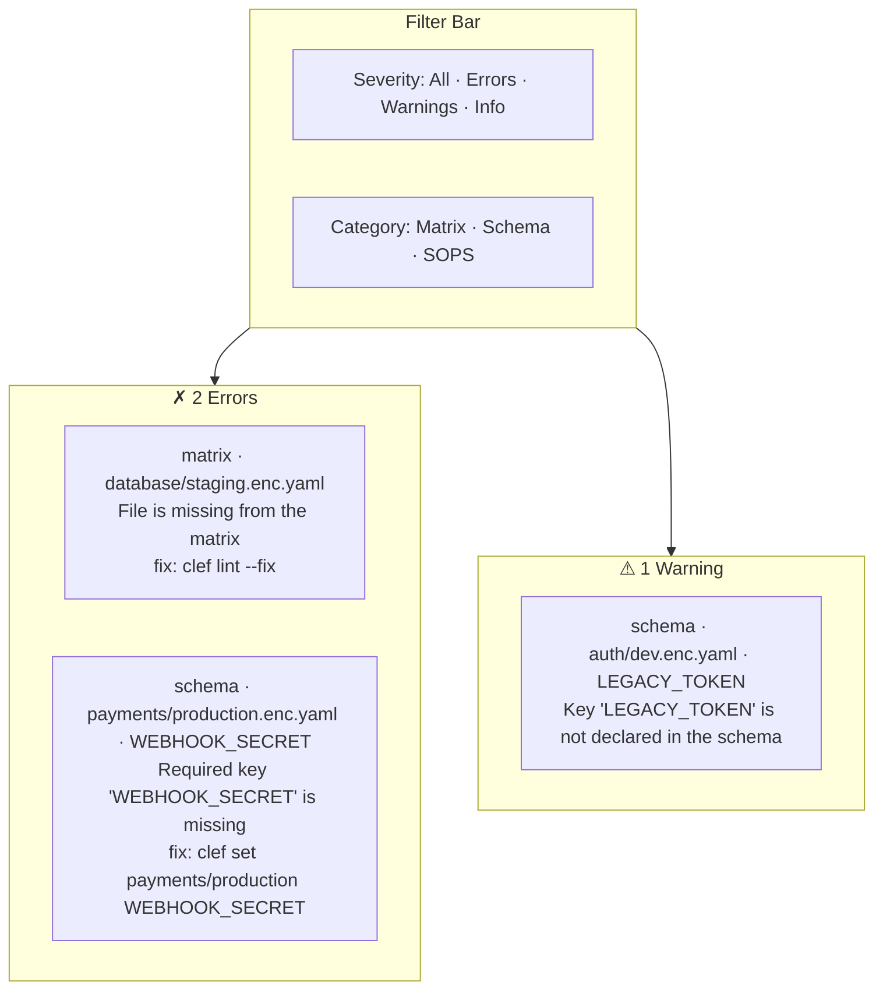

# Lint View

Full-repo health report: every matrix file scanned, issues grouped by severity with fix commands.

## Layout



## Filter bar

Two sets of filters at the top of the view:

### Severity filters (left side)

- **All** — show all issues
- **Errors** — errors only (red)
- **Warnings** — warnings only (yellow)
- **Info** — informational issues only (blue)

### Category filters (right side)

- **Matrix** — completeness issues (missing files, incomplete matrix)
- **Schema** — validation issues (missing required keys, type mismatches, undeclared keys)
- **SOPS** — encryption issues (invalid metadata, decryption failures)

Both sets can be combined (e.g., "Errors" + "Schema" shows only schema errors).

## Issue groups

Issues are grouped by severity (errors first, then warnings, then info), each with a coloured header and count badge.

## Issue cards

Each issue card contains:

| Element            | Description                                                                                                                                   |
| ------------------ | --------------------------------------------------------------------------------------------------------------------------------------------- |
| **Category badge** | Coloured tag showing "matrix", "schema", or "sops"                                                                                            |
| **File reference** | The path to the affected file (e.g., `payments/production.enc.yaml`). Clickable — navigates to the editor for that namespace and environment. |
| **Key reference**  | The specific key involved, if applicable (e.g., `WEBHOOK_SECRET`)                                                                             |
| **Message**        | Plain-English description of the issue                                                                                                        |
| **Fix command**    | The CLI command to resolve the issue (if available), with a **copy** button                                                                   |
| **Dismiss button** | Temporarily hides the issue from the current session                                                                                          |

## Severity semantics

| Severity    | Blocks commit? | Examples                                                                           |
| ----------- | -------------- | ---------------------------------------------------------------------------------- |
| **Error**   | Yes            | Missing required key, missing matrix file, invalid SOPS metadata                   |
| **Warning** | No             | Undeclared key (key exists in file but not in schema), value exceeds schema max    |
| **Info**    | No             | Key with no schema definition, single-recipient encryption (a note, not a problem) |

## All-clear state

When every issue is resolved, the view shows a large green checkmark and "All clear — N files healthy". **Commit changes** becomes active if there are uncommitted changes.

## CLI equivalent

The lint view corresponds to `clef lint`:

```bash
clef lint
clef lint --fix
clef lint --json
```

The UI adds interactive filtering, clickable navigation to the editor, and copy-to-clipboard fix commands.
